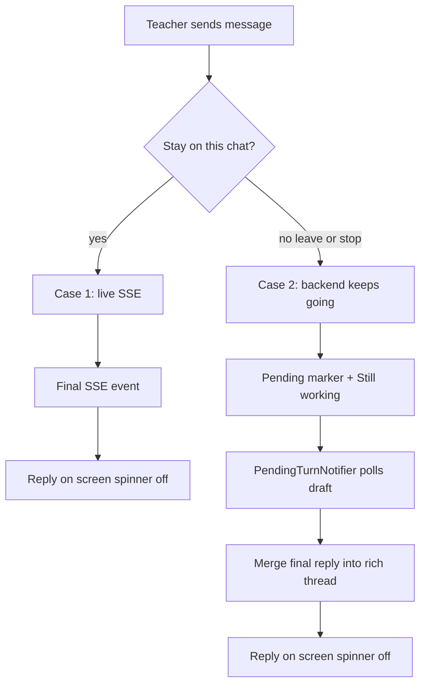

# Chat message / turn lifecycle issue report

> **Superseded (2026-07-16) — historical record.** The hybrid architecture this
> report describes was replaced by *runner-lite* (H3) and the backend-owned
> Running box (M2). Turn phases are now `streaming` / `awaiting_backend` /
> `settled` in `workflow-draft-store.ts` (`workflow-turn-state.ts` is gone);
> the sessionStorage marker system (`pending-chat-turns.ts`) and the runtime's
> recovery poll are deleted, and `PendingTurnNotifier` reads
> `GET /api/workflow/active` instead. For the current design see
> `docs/beta_readiness_audit_2026-07-13.md` (§A.1) and
> `frontend/ARCHITECTURE.md`. Keep this file for the bug history and the
> product intent in §1, which still hold.

**Status:** Resolved by runner-lite + M2; kept for history  
**Worktree:** `feature/class-home-discussion` (KlassenPilot)  
**Last updated:** 2026-07-13 (banner added 2026-07-16)  
**Scope:** Plan, Update Memory (ingest), and Discuss — shared chat stack

This document captures the product intent, the hybrid architecture we shipped,
the bugs we hit repeatedly, the fixes applied, the six scenario tests, and what
is still fragile. Use it as the handoff when picking the work back up.

---

## 1. Product intent (two cases only)

Teachers care about two observations, for all three chat workflows
(`plan` | `ingest` | `discuss`):



| Case | Teacher action | Expected UI |
|---|---|---|
| **1 — Stay on page** | Send and wait | Live reasoning / tools / text; Stop button while streaming; final reply appears; spinner off |
| **2 — Leave mid-turn** | Navigate away (or Stop) while generating, then return | Keep already-streamed reasoning/tools; show **Still working on your response…**; when backend finishes, merge final reply into that thread; spinner off |

**Explicit non-goals (MVP hybrid):**

- Backend persistence / replay of reasoning or tool-call parts
- Surviving hard refresh with full Reasoning UI (plain reply + turn flags OK)

**Revisit later:** Case 2 still needs stronger HITL / integration coverage for
notifier races and dock remounts; see §7–8.
---

## 2. Architecture we built (compose, don’t copy)

Shared stack for all three modes:

```text
Shell (plan page / memory page / discuss dock)
  → ArtifactSessionRuntimeProvider
  → useWorkflowChatRuntime (assistant-ui ExternalStore)
  → Thread (+ WorkingStatus)
  → workflow-draft-store (Zustand) + pending-chat-turns + PendingTurnNotifier
```

| Module | Path | Role |
|---|---|---|
| Turn phases | `frontend/src/features/workflow-drafts/workflow-turn-state.ts` | `idle` / `streaming` / `backend_running` / `complete` / `failed` |
| UI mapping | `frontend/src/features/workflow-drafts/workflow-turn-activity.ts` | Stop vs Still-working |
| Draft + rich thread | `frontend/src/features/workflow-drafts/workflow-draft-store.ts` | Flags + in-memory reasoning/tools; merge final reply on complete |
| Runtime | `frontend/src/components/assistant-ui/artifact-session-runtime.tsx` | `onNew`, SSE, AbortSignal, cancel, recovery poll |
| Runtime config | `frontend/src/components/assistant-ui/artifact-runtime-config.ts` | Per-mode stream + `fetchDraft` |
| Pending jobs | `frontend/src/lib/pending-chat-turns.ts` + `pending-turn-notifier.tsx` | Background completion for all modes including `discuss` |
| Docs | `frontend/ARCHITECTURE.md` (§ Testing chat turns), `frontend/DESIGN.md` | How to reuse / test |

**Backend (already correct for Case 2):**  
`ArtifactSessionService.chat_stream` runs the model turn in a service-owned task;
the HTTP SSE connection is only a subscriber. Browser abort must **not** cancel
the backend turn.

**Config knobs (do not confuse):**

| Knob | Controls |
|---|---|
| `MODEL_PROFILE` | Which model + reasoning **effort** (`production` = top-tier) |
| `APP_ENV` | Stream visibility: `development` = raw CoT; `production` = stub “Working through the request…” |
| `BETA_*` / wiki host | Auth and which wiki files — unrelated to turn spinner |

HITL combo used while debugging:  
`--app-env development --model-profile production`  
(Frontend ~`http://localhost:3928`, backend ~`http://localhost:8782` — ports are
worktree-stack generated.)

---

## 3. Timeline of work and issues

### 3.1 Hybrid refactor (planned)

Plan: [chat_turn_hybrid_refactor](../.cursor/plans/) (local plan file; do not treat as repo source of truth).

Shipped:

1. Shared turn state machine + runtime wiring  
2. Discuss pending-turn parity (filter, class-home href, notifier path)  
3. AbortSignal on stream / unmount; discuss dock hydrate-from-Zustand then open-or-resume  
4. Frontend architecture docs  
5. Composer **Cancel** wired via `onCancel` → abort (was disabled because
   `ExternalStoreAdapter.cancel` requires `onCancel`)

### 3.2 Recurring symptom

UI shows:

- Collapsed **Reasoning** (and sometimes tool calls)
- **Still working on your response…** forever
- Send button (not Stop) → local SSE already ended; `turnInProgress` stuck true
- Final assistant **text missing** in the thread

Meanwhile the backend draft often already has:

- `turn_in_progress: false`
- `latest_turn_complete: true`
- Full assistant reply in `messages`

So this is frequently a **client hydration / pending-notify bug**, not a hung model.

### 3.3 Root causes identified

#### A. Abort `finally` races the notifier

Leave/unmount aborts SSE → `resolveClientStreamEnd` → `backend_running` →
upsert `turnInProgress: true`.

If `PendingTurnNotifier` already applied the completed draft (`turnInProgress:
false`), the abort `finally` could **regress** flags back to in-progress.
Pending may already be consumed → no further polls → spinner stuck forever.

**Mitigation:** In runtime `finally`, if phase is `backend_running` but the store
already shows complete, do not regress.

#### B. Rich thread kept without merging final text

`shouldKeepLiveThread` preserves reasoning/tools over plain snapshot messages.
After leave/return, the live thread often has reasoning/tools but **no text
part**. Completion upsert kept the rich thread and **dropped** the persisted
reply.

**Mitigation:** On complete upsert, if the last assistant lacks text,  
`mergeFinalReplyIntoThread(...)`.

#### C. Notifier gated upsert behind toast eligibility (critical)

`shouldNotifyPendingDraftComplete` requires `seenInProgress` **or** message
count growth past baseline. That was meant to avoid toasting the *previous*
turn’s idle-complete state when a pending marker is written before the new turn
starts.

But the notifier **returned early without upserting** when that guard failed.
Result: backend complete, client still `turnInProgress: true`, endless GET
`/draft` polls, spinner never clears. Confirmed live against discuss session
`b4c114ab-…` (draft already had the “rap” reply; UI still spun).

**Mitigation:** When draft is complete:

1. **Always** upsert (clear spinner / merge reply)
2. Clear pending if toast-eligible **or** local store still shows
   `turnInProgress: true` (stuck-spinner recovery)
3. Toast only when toast-eligible and not on the current page

#### D. Cancel button appeared disabled

`useExternalStoreRuntime` sets `cancel: onCancel !== undefined`. We aborted on
unmount but never passed `onCancel` → Stop looked disabled.

**Mitigation:** Wire `onCancel` → `AbortController.abort()` for all modes.

#### E. Port / stack confusion during HITL

Worktree stack restart shifted ports (`3927` → `3928`). Old URL looked “down”
or served stale behavior.

---

## 4. Fixes currently in the tree

| Area | Change |
|---|---|
| Turn state | `workflow-turn-state.ts` + runtime `finally` race guard |
| Store | Keep rich parts while in progress; merge final reply on complete |
| Cancel | `workflow-chat-runtime.tsx` `onCancel` + runtime abort |
| Notifier | Always upsert on complete; stuck-spinner consume path |
| Runtime recovery | While Still-working and no live SSE, poll `fetchDraft` every 2s and upsert if backend done |
| Discuss dock | Prefer Zustand cache then open-or-resume API |
| Docs | `frontend/ARCHITECTURE.md` testing section; this report |

---

## 5. The six scenario tests

**File:**  
[`frontend/src/features/workflow-drafts/chat-turn-scenarios.test.ts`](../frontend/src/features/workflow-drafts/chat-turn-scenarios.test.ts)

**Matrix:** 3 workflows × 2 cases = **6 tests** (deterministic Vitest; no OpenAI / browser).

| # | Mode | Case | Asserts |
|---|---|---|---|
| 1 | plan | Stay on page | Stop on / Still-working off mid-stream; after final both off; reply text present |
| 2 | plan | Leave mid-turn | Still-working on; rich kept; no text; after upsert reply merged; spinner off |
| 3 | ingest | Stay on page | same as 1 |
| 4 | ingest | Leave mid-turn | same as 2 |
| 5 | discuss | Stay on page | same as 1 |
| 6 | discuss | Leave mid-turn | same as 2 |

**Run:**

```powershell
cd frontend
npx vitest run src/features/workflow-drafts/chat-turn-scenarios.test.ts
```

**Related unit coverage:**

| File | Covers |
|---|---|
| `workflow-turn-state.test.ts` | Phase → flags |
| `workflow-turn-activity.test.ts` | Stop vs Still-working |
| `workflow-draft-store.test.ts` | Keep rich; merge final reply |
| `pending-chat-turns.test.ts` | Markers + discuss resume href |
| `thread-background-status.test.ts` | Banner copy |

Documented for agents in  
[`frontend/ARCHITECTURE.md`](../frontend/ARCHITECTURE.md#testing-chat-turns).

Last local run (2026-07-13): scenario suite + related turn tests **passed**
(39 tests in the focused batch; `tsc --noEmit` clean).

These tests prove the **store / phase / observation contract**. They do **not**
fully reproduce the notifier race or a live Docker SSE abort; that still needs
HITL or a future integration test that mocks `PendingTurnNotifier` + fetch.

---

## 6. How to reproduce the stuck spinner (HITL)

1. Start stack:  
   `.\scripts\worktree-stack.cmd up --app-env development --model-profile production`
2. Open class home Discuss (use the printed frontend port, not a stale one).
3. Send a non-trivial message (tools + reasoning).
4. While Reasoning is visible, navigate away (e.g. Create lesson plan) or close
   the dock, then return.
5. Observe: Still working… with reasoning only.
6. Check backend:  
   `GET /api/classes/{id}/discussion/sessions/{sessionId}/draft`  
   Often already `turn_in_progress: false` with full `messages` — UI bug if so.

---

## 7. What still feels fragile / follow-ups

1. **Notifier toast guard vs hydrate** — fixed for upsert, but baseline /
   `seenInProgress` edge cases can still skip toast or delay pending clear;
   worth a dedicated notifier unit test for “complete + local stuck spinner”.
2. **Discuss `boot.turnInProgress` frozen** — dock passes boot flags into
   config; runtime syncs from Zustand via `storedDraft`, but boot can confuse
   remounts. Consider binding live store flags into the dock config carefully
   (without resetting mid-stream).
3. **No browser E2E** — six Vitest scenarios are the gate; optional Playwright
   against Docker would catch the real notifier/SSE race.
4. **Stop vs leave** — Cancel aborts client SSE only; backend still finishes
   (by design). Teachers may expect Stop to cancel the server job too.
5. **Hard refresh** — still loses rich Reasoning UI (accepted MVP non-goal).
6. **Uncommitted / partial commits** — confirm which of these fixes are
   committed on the branch before the next session.
7. **Running box → Discuss** — click should open
   `/classes/{id}?discuss=open` and expand the dock (closed or minimized).
   Implemented 2026-07-13 via `pendingTurnWorkflowHref` + class-home
   `discuss=open` handling.

---

## 8. Suggested next steps (when resuming)

1. Hard-refresh the current worktree frontend URL and confirm Discuss recovers
   within ~2s via recovery poll / notifier upsert (backend already complete in
   the last incident).
2. Add a focused test: “draft complete + `shouldNotify` false + local
   `turnInProgress` true → upsert + clear pending”.
3. Optional: instrument temporary `console.debug` around notifier upsert /
   runtime recovery (remove after).
4. Only then consider backend cancel-turn API if product wants Stop to kill the
   server job.

---

## 9. Key file index

```text
frontend/src/features/workflow-drafts/
  workflow-turn-state.ts
  workflow-turn-activity.ts
  workflow-draft-store.ts
  workflow-chat-runtime.ts
  chat-turn-scenarios.test.ts          ← the 6 tests
frontend/src/components/assistant-ui/
  artifact-session-runtime.tsx
  artifact-runtime-config.ts
  thread.tsx                           ← WorkingStatus
frontend/src/components/klassenpilot/
  pending-turn-notifier.tsx
  discuss-dock.tsx
frontend/src/lib/pending-chat-turns.ts
frontend/ARCHITECTURE.md
backend/app/services/artifact_session_service.py   ← background stream task
backend/app/services/stream_safety.py              ← production CoT stub
docs/chat_message_issue.md                         ← this report
```

---

## 10. Bottom line

We intentionally split **live SSE** from **backend turn**. That is the right
MVP model. The frustration has come from client-side races: abort `finally`
vs notifier, keeping rich parts without merging the reply, and skipping draft
upsert when toast guards failed — while the backend had already finished.

The six scenario tests lock the observation contract. The remaining risk is
integration timing (notifier / pending / dock remount), which is why HITL still
sees “Still working…” after the model is done. Treat that as the primary
follow-up, not a new architecture.
