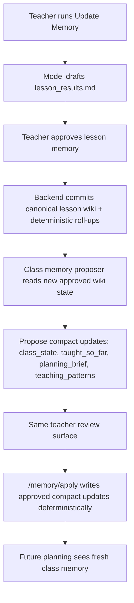
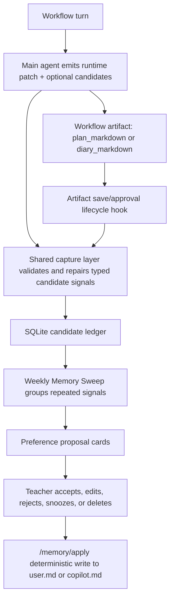

# Agent Memory V2 Design

Status: design draft  
Date: 2026-06-22  
Owner: KlassenPilot agent architecture

## 1. Problem We Are Solving

KlassenPilot uses a Karpathy-style markdown wiki as persistent compiled memory.
The current MVP already has a useful human-in-the-loop memory loop:

1. The teacher chats with the copilot.
2. The model produces a structured lesson result or lesson plan.
3. The teacher approves writes.
4. The wiki becomes more useful for future planning.

The next problem is more subtle. The product must keep memory current without
turning every chat into an uncontrolled memory write.

There are five related but distinct features:

1. **Class memory updates**  
   Keep class state, taught-so-far, planning brief, and teaching patterns current
   after approved lesson memory and saved plans.

2. **User behavior and teaching-signal collection**  
   Capture subtle signals from chats without storing full chat transcripts:
   repeated communication preferences, copilot corrections, new professional
   context, class learning responses, and subject-teaching ideas.

3. **User preference and copilot-profile modification**  
   Promote high-signal teacher and copilot behavior observations into bounded
   `user.md` / `copilot.md` memory only after teacher review.

4. **Wiki linter and reviewer**  
   Detect stale, duplicated, contradictory, overlong, or weakly grounded memory.
   It may propose changes to compact core memory files, but canonical lesson
   wiki writes stay separate.

5. **Weekly sync wrapper**  
   Provide one teacher-triggered review surface that runs preference promotion,
   subject/concept review, compact-memory consolidation, and wiki lint review.

The key design correction from the discussion is this:

> Weekly sync must not be the only mechanism that updates class state. After a
> teacher approves a lesson-memory update, compact class memory should be
> refreshed immediately through the same approval flow, so the class is not
> stale for up to six days.

Weekly sync is for consolidation, memory hierarchy review, linting, and slow
promotion. It is not a replacement for immediate class-memory maintenance.

## 2. Current Implementation Status

### 2.1 What Already Exists

The current implementation already has the right first layer: structured memory
candidates are emitted from both workflows, carried in runtime state, surfaced
through API/SSE responses, and only written through explicit apply endpoints.

Relevant files:

- `backend/app/teacher_agent/models.py`
- `backend/app/teacher_agent/planning_state.py`
- `backend/app/teacher_agent/memory_update_state.py`
- `backend/app/teacher_agent/agents.py`
- `backend/app/api/routes.py`
- `backend/app/services/memory_apply.py`
- `backend/app/teacher_agent/wiki/memory.py`

Current structured output contract:

```python
# backend/app/teacher_agent/models.py
class IngestTurnOutput(BaseModel):
    ...
    memory_candidates: list[MemoryCandidate] = Field(
        default_factory=list,
        description=(
            "Durable-memory update candidates from the update-memory chat. "
            "These are proposed only and require teacher approval before any write."
        ),
    )

class PlanTurnOutput(BaseModel):
    ...
    memory_candidates: list[MemoryCandidate] = Field(
        default_factory=list,
        description="Durable-memory update candidates (proposed only; never written during chat)",
    )
```

Current candidate schema:

```python
# backend/app/teacher_agent/planning_state.py
MEMORY_TARGETS = (
    "class_state.md",
    "planning_brief.md",
    "taught_so_far.md",
    "teaching_patterns.md",
    "copilot.md",
    "copilot_profile.md",
    "user.md",
    "teacher_profile.md",
    "canonical_wiki",
)

class MemoryCandidate(BaseModel):
    """A possible durable-memory update, tracked but never written during chat."""

    target: str = "copilot.md"
    section: str = "General"
    candidate_update: str = ""
    evidence: str = ""
    evidence_refs: list[str] = Field(default_factory=list)
    source: str = "inferred_from_session"
    basis: str = "inferred"
    confidence: str = "low"
    requires_teacher_approval: bool = True
```

Current apply path is deterministic:

```python
# backend/app/services/memory_apply.py
def apply_memory_items(
    wiki, class_id: str, items
) -> tuple[list[str], list[str], list[str]]:
    """Write supported items; return (applied_paths, skipped, warnings)."""
    ...
    for item in items:
        content = (item.content or "").strip()
        ...
        target = _TARGET_ALIASES.get(item.target, item.target)
        try:
            if target == "user.md":
                applied.append(wiki.add_user_profile_conclusion(section, content))
            elif target == "copilot.md":
                applied.append(wiki.add_profile_conclusion(class_id, section, content))
            elif target in _COMPACT_TARGETS:
                applied.append(
                    wiki.add_compact_memory_conclusion(
                        class_id, _COMPACT_TARGETS[target], section, content
                    )
                )
            else:
                skipped.append(f"unsupported target: {item.target}")
```

Compact memory is bounded:

```python
# backend/app/teacher_agent/wiki/memory.py
MEMORY_PAGE_BUDGETS: dict[str, int] = {
    "user": 1500,
    "copilot_profile": 1500,
    "teaching_patterns": 2200,
    "class_state": 1800,
    "taught_so_far": 1500,
    "planning_brief": 1200,
    "session_summaries": 1200,
    "subject_guide": 1400,
}
```

Current proposal endpoints:

- `POST /classes/{id}/memory/refresh` proposes compact derived memory pages.
- `POST /classes/{id}/memory/profile/propose` proposes `user.md` / `copilot.md`
  updates.
- `POST /classes/{id}/memory/apply` writes approved bounded items.
- `POST /classes/{id}/memory/compact` writes a full derived-page rebuild.

The important interpretation:

- `memory_candidates` are a typed slot, not a durable ledger.
- `IngestTurnOutput` and `PlanTurnOutput` enforce shape, not semantic coverage.
  The model can still emit an empty list.
- `PlanRuntime` and `MemoryRuntime` preserve candidates during a session, but
  they do not solve weekly accumulation across sessions.
- `/memory/apply` is not triggered automatically after every chat turn.

### 2.2 Current Gaps

The current system does not yet have:

- durable SQLite storage for cross-session candidate evidence;
- promotion thresholds for repeated signals;
- a clear channel split between class evolution, teacher behavior, subject
  concept updates, and wiki lint;
- immediate compact-memory refresh coupled to approved lesson-memory commits;
- weekly review UI and API wrapper;
- subject-guide promotion path for files such as `wiki/subjects/chemie.md`;
- memory hierarchy review as proposal-only output;
- memory-lint apply paths that can update compact core class memory while still
  keeping canonical lesson wiki writes separate.

## 3. Architecture Terms

### 3.1 Memory Surfaces

KlassenPilot should distinguish five surfaces:

1. **Canonical lesson wiki**  
   Approved lesson results, lesson plans, roll-ups, timeline, student files, and
   raw lesson evidence. This is the historical source of truth.

2. **Subject guide**  
   `wiki/subjects/{subject}.md`, for example `wiki/subjects/chemie.md`.
   This is subject-wide teaching guidance, not class-specific observation.
   It should update slowly because it affects all classes for that subject.

3. **Compact class memory**  
   `memory/class_state.md`, `memory/taught_so_far.md`,
   `memory/planning_brief.md`, and `memory/teaching_patterns.md`.
   These are bounded, prompt-facing summaries derived from approved evidence.

4. **Teacher and copilot profile memory**  
   Global `wiki/teacher_profile.md` (`user.md`) and class-scoped
   `memory/copilot_profile.md` (`copilot.md`).

5. **Candidate ledger**  
   A SQLite database outside canonical wiki memory. It stores observations,
   evidence summaries, statuses, grouping keys, and review outcomes. It is not
   injected as durable truth.

### 3.2 Candidate Channels

The ledger should explicitly classify candidates:

| Channel | Examples | Promotion speed | Target examples |
| --- | --- | --- | --- |
| `class_evolution` | current unit moved on, next likely move, assessment readiness | immediate after approved class evidence | `class_state.md`, `planning_brief.md`, `taught_so_far.md` |
| `class_learning_pattern` | class responds better to worked examples, retrieval practice helped | after approved lesson evidence; sometimes immediate if teacher confirms | `teaching_patterns.md` |
| `teacher_behavior` | asks for concise MBB style, dislikes long generic plans | slow; repeated signals or explicit statement | `user.md`, `copilot.md` |
| `subject_concept` | a new chemistry teaching method or reusable misconception pattern | weekly review; never infer subject-wide from one weak class signal | `wiki/subjects/chemie.md` |
| `wiki_lint` | duplicate compact bullets, stale class state, contradictions | weekly or manual | compact memory pages; canonical wiki review-only |
| `memory_sweep` | hierarchy/routing issues, stale compact pages, wrong target choices | weekly review | review proposals, not direct writes |

### 3.3 Write Ownership Boundaries

Some memory files are touched by more than one workflow. The boundary is not
"one file, one writer"; it is "every proposed write declares its channel,
evidence source, and approval path."

| File | Immediate after approved lesson? | Weekly Memory Sweep? | Teacher behavior channel? |
| --- | --- | --- | --- |
| `class_state.md` | Yes | Yes | No |
| `taught_so_far.md` | Yes | Yes | No |
| `planning_brief.md` | Yes | Yes | Rarely |
| `teaching_patterns.md` | Yes, if strong class evidence | Yes | No, unless class-learning related |
| `session_summaries.md` | Maybe session/weekly only | Yes | No |
| `copilot_profile.md` (`copilot.md`) | No, except explicit copilot correction | Yes | Yes |
| `teacher_profile.md` (`user.md`) | No | Yes | Yes |
| `wiki/subjects/{subject}.md` | No, unless explicit subject-wide update | Yes | Not teacher preference |

Interpretation:

- **Immediate class refresh** keeps current class memory useful right after an
  approved lesson update.
- **Weekly Memory Sweep** consolidates, lints, and corrects hierarchy/routing
  mistakes.
- **Teacher behavior** means signals about how the teacher wants the copilot to
  behave, such as concise MBB-style output, board-ready formatting, or repeated
  copilot corrections. It normally updates `teacher_profile.md` / `user.md` or
  class-scoped `copilot_profile.md`, not class-learning files.

### 3.4 Shared Workflow Memory-Capture Layer

`PlanRuntime` and `MemoryRuntime` should not inherit one large common runtime
object. Their workflow state is different on purpose:

- lesson planning owns `PlanRuntime.session_state`,
  `lesson_planning_state`, `plan_version`, and the plan artifact;
- update-memory owns `MemoryRuntime.target`, `lesson_result_state`,
  `diary_version`, `unsupported_intent_reason`, and the diary artifact.

The shared layer should be narrower and should cover only durable-memory
capture concerns:

- `memory_candidates`;
- candidate validation, allowlisting, dedupe, caps, and rendering;
- evidence references and source metadata;
- conversion into SQLite ledger rows;
- lifecycle hooks such as turn-complete, artifact-approved, session-end, and
  pre-compaction/session-summary capture.

This mirrors the useful pattern in Hermes/OpenClaw-style agent memory:

- workflow state stays task-owned and hot-path;
- memory providers/capture systems sit behind a single lifecycle surface;
- per-turn capture is best-effort and non-blocking;
- slower consolidation runs at session end, artifact approval, or weekly review;
- prompt-facing durable memory is updated only through a reviewed apply path.

The immediate bug class is therefore fixed at the shared capture boundary, not
by adding a planning-only special case. If a workflow model already detected a
durable preference in structured state but failed to duplicate it into
`memory_candidates`, the backend may normalize that structured signal into a
review-only candidate. That normalization must operate on typed runtime state,
not broad raw-message keyword scraping.

Candidate capture should have two tiers:

1. **Hot-path candidate emission**  
   The main workflow model emits `memory_candidates` in `PlanTurnOutput` or
   `IngestTurnOutput` when it recognizes durable teacher/class/copilot facts.
   These are immediately visible in runtime state, SSE/API payloads, and the
   SQLite ledger.

2. **Lifecycle consolidation**  
   After artifact approval, session end, or explicit Memory Sweep, a bounded
   memory-capture job may inspect the latest messages, workflow runtime,
   artifact, and existing candidates to add missed ledger evidence. This is not
   a second live chat agent; it is a memory manager hook with structured output
   and no wiki-write authority.

Only the ledger-candidate surface should be shared now. Evidence brief helpers
and raw-store pruning can be factored later if duplication becomes painful, but
the plan/diary artifacts and workflow-specific runtime fields should stay
separate.

## 4. Desired Flow

### 4.1 Immediate Class-Memory Refresh After Approved Lesson Update

Current concern: if the teacher approves a lesson-memory update on Monday and
class memory waits until Sunday, planning can be stale for six days.

Target flow:



This should feel like one product action: "Save lesson memory and update class
snapshot." Internally it may call a separate function, but the teacher should
not have to wait for Weekly Memory Sweep.

Implementation rule:

- LLM may propose compact updates from the newly approved wiki state.
- Teacher approves the compact update bundle.
- `/memory/apply` writes deterministic bounded operations.
- If compact generation fails, canonical lesson commit still succeeds and the UI
  shows "class snapshot refresh failed, retry" rather than blocking the lesson
  record.

### 4.2 Lesson Planning Flow

Lesson planning remains read-only with respect to canonical wiki writes.

During each planning turn:

1. The model updates `PlanRuntime`.
2. The model may emit `memory_candidates`.
3. The shared capture layer validates and dedupes emitted candidates.
4. The shared capture layer may normalize durable signals already present in
   typed runtime state into review-only candidates. Example: a teacher-wide
   communication preference captured in `lesson_planning_state` but missed in
   top-level `memory_candidates`.
5. Candidates are copied to the SQLite ledger with `source_session_id`,
   `workflow=lesson_plan`, and status `captured`.
6. Saving the lesson plan stores the plan artifact. It does not automatically
   mutate teacher profile or canonical wiki memory.

After save:

- the shared capture lifecycle can run a bounded artifact-approved review over
  `messages + PlanRuntime + plan_markdown + current candidates` to add missed
  ledger rows;
- explicit class-state implications can be proposed immediately;
- subtle teacher behavior remains in the ledger for weekly promotion;
- subject-wide concept changes are captured as high-signal candidates but wait
  for weekly review unless the teacher explicitly asks to update the subject
  guide now.

### 4.3 Teacher Behavior And Preference Flow

Teacher behavior is slow memory. The system should not rewrite `user.md` because
of one incidental phrasing pattern.

Flow:



Promotion thresholds:

- explicit teacher preference: eligible after one strong signal;
- repeated behavior: require at least two sessions, or three similar events;
- inferred preference: low confidence, always teacher-approved;
- role/context change: explicit teacher statement required;
- sensitive student facts: never promote into broad teacher profile memory.

### 4.4 Subject Concept And Teaching-Method Flow

The teacher may introduce or adopt a new method that belongs in subject memory,
for example a chemistry-wide diagnostic pattern, a new safety reminder, or a
reusable way to introduce redox concepts.

Rules:

- If the signal is class-specific, target `teaching_patterns.md`.
- If it is subject-wide, target `wiki/subjects/{subject}.md`.
- Do not infer subject-wide guidance from one class unless the teacher states it
  as generally reusable.
- Subject-guide updates are high impact because they affect all future classes
  for the subject; they should normally wait for weekly review.
- The weekly review should show "class-specific" vs "subject-wide" classification
  and let the teacher move a proposal between targets.

Example:

| Observation | Correct target |
| --- | --- |
| "9b finally understood redox after metal-displacement demos." | `teaching_patterns.md` |
| "For chemistry classes, always introduce oxidation numbers after electron transfer." | `wiki/subjects/chemie.md` |
| "This teacher wants all plan summaries in MBB style." | `user.md` |
| "For this class, avoid long discovery phases on Fridays." | `copilot.md` or `teaching_patterns.md`, depending on framing |

### 4.5 Wiki Linter And Reviewer Flow

The linter should be allowed to update compact core class memory through the
same deterministic apply function used by class-memory refresh. It should not
silently rewrite canonical lesson pages.

Allowed linter proposal targets:

- compact class memory replacement or consolidation;
- stale compact bullets;
- duplicate teacher/copilot preference bullets;
- subject-guide cleanup proposals;
- canonical wiki lint findings as review-only issues.

Disallowed automatic linter writes:

- lesson result rewrites;
- student-file rewrites;
- roll-up rewrites outside the normal deterministic lesson commit path;
- prompt or docs edits.

The linter can propose a compact-memory fix such as:

```json
{
  "channel": "wiki_lint",
  "target": "class_state.md",
  "operation": "replace_section",
  "section": "Current State",
  "rationale": "Existing state says the class is preparing oxidation numbers, but the last three approved lessons show the unit moved to redox applications.",
  "evidence_refs": [
    "wiki/classes/chemie_9b_2026_27/lessons/2026-05-21/lesson_results.md",
    "wiki/classes/chemie_9b_2026_27/lessons/2026-05-29/lesson_results.md"
  ]
}
```

### 4.6 Weekly Memory Sweep

Weekly Memory Sweep is the teacher-triggered review workflow. It is inspired by
OpenClaw's scheduled consolidation pattern, but uses a more direct product name
and a stricter HITL boundary. It is not a hidden background mutation.

It runs these proposal jobs:

1. **Class memory consolidation**  
   Refresh compact pages from approved wiki evidence and recent grounded class
   candidates.

2. **Teacher/copilot preference review**  
   Group repeated teacher-behavior and copilot-correction candidates.

3. **Subject concept review**  
   Review high-signal subject-wide candidates for files like
   `wiki/subjects/chemie.md`.

4. **Wiki lint review**  
   Detect stale, duplicate, contradictory, weakly grounded, or over-budget wiki
   memory.

5. **Memory hierarchy review**  
   Check whether observations are routed to the right layer: class compact
   memory, subject guide, teacher profile, copilot profile, or canonical wiki
   review.

6. **Developer notes, optional**  
   If enabled for developer builds, produce prompt/doc improvement suggestions.
   These are not teacher-facing memory and cannot change runtime prompts.

The output should be a review inbox with tabs:

- Class Evolution
- Teacher/Copilot Preferences
- Subject Concepts
- Wiki Review
- Memory Sweep

Each card should show:

- proposed change;
- target page and section;
- current memory excerpt;
- evidence summary;
- evidence refs;
- confidence and basis;
- "why now";
- accept, edit, reject, snooze, delete.

## 5. Memory Sweep And Reflection Boundary

LangGraph's memory documentation describes reflection/meta-prompting as a way to
refine agent instructions from current prompts, recent interactions, and user
feedback. For KlassenPilot, the product version should be **Memory Sweep**:
reflection over the memory hierarchy, not self-modification of the agent.

Memory Sweep may propose:

- teacher preference updates;
- class copilot working-agreement updates;
- subject-guide candidates;
- wiki lint findings;
- memory-hierarchy routing corrections.

Memory Sweep may not directly:

- edit system prompts;
- edit `docs/`;
- rewrite wiki files;
- call `/memory/apply`;
- convert candidates into durable truth.

Developer-only prompt reflection can exist later as a separate engineering
review stream. It should read anonymized review outcomes, prompt traces, docs,
and safety contracts, then produce a proposal file or issue. It should never
create per-user prompt drift. Any prompt or architecture change requires normal
code review, prompt versioning, and tests.

Reason: self-modifying prompts are product behavior changes, not teacher memory.
They are high risk because wiki pages, uploads, and candidate evidence may
contain prompt injection. Teacher memory changes need teacher review; prompt
changes need developer review.

## 6. Candidate Ledger Design

Use SQLite rather than JSONL.

Why:

- status transitions matter;
- rejections must stay rejected;
- weekly grouping needs queries;
- teacher review needs edit/delete/snooze;
- auditability matters for trust;
- JSONL is easy to append but brittle for stateful review workflows.

Proposed storage location:

```text
backend/teacher_wiki/workflow/memory_candidates.sqlite
```

This keeps it outside `wiki/`, so it does not read like canonical memory.

Minimum table:

```sql
CREATE TABLE memory_candidates (
  id TEXT PRIMARY KEY,
  created_at TEXT NOT NULL,
  updated_at TEXT NOT NULL,
  class_id TEXT,
  subject TEXT,
  workflow TEXT NOT NULL,
  session_id TEXT,
  turn_index INTEGER,
  channel TEXT NOT NULL,
  target TEXT NOT NULL,
  section TEXT NOT NULL,
  candidate_update TEXT NOT NULL,
  evidence_summary TEXT NOT NULL,
  evidence_refs_json TEXT NOT NULL,
  source TEXT NOT NULL,
  basis TEXT NOT NULL,
  confidence TEXT NOT NULL,
  cluster_key TEXT,
  status TEXT NOT NULL,
  promoted_at TEXT,
  review_batch_id TEXT,
  rejection_reason TEXT
);
```

Suggested status lifecycle:

```text
captured -> grouped -> proposed -> approved -> applied
captured -> grouped -> proposed -> rejected
captured -> grouped -> proposed -> snoozed
captured -> deleted
captured -> expired
```

Important: a rejected candidate or cluster must not reappear unless new evidence
substantially changes it.

## 7. Deterministic Apply Boundary

Keep `/memory/apply` deterministic.

LLMs can:

- extract candidates;
- group similar observations;
- propose target pages;
- propose replacement text;
- explain evidence;
- lint and reflect.

LLMs cannot:

- write files directly;
- decide approval;
- bypass target allowlists;
- write unsupported pages;
- silently promote inferred preference into durable memory.

`/memory/apply` should support more operation types over time:

| Operation | Use |
| --- | --- |
| `append_bullet` | add one approved bounded conclusion |
| `replace_section` | replace an approved compact-memory section |
| `replace_page` | replace an approved compact page from a refresh proposal |
| `mark_candidate_status` | reject, snooze, delete, or expire candidates |
| `subject_guide_patch` | approved bounded edit to `wiki/subjects/{subject}.md` |

All apply operations need:

- target allowlist;
- section allowlist or sanitized section name;
- char budget check;
- source/evidence refs;
- optional hash or version precondition;
- audit log entry.

## 8. Source Learnings

### 8.1 OpenAI Agents SDK And Cookbook

Sources:

- Running agents: https://developers.openai.com/api/docs/guides/agents/running-agents
- Guardrails and human review:
  https://developers.openai.com/api/docs/guides/agents/guardrails-approvals
- Sandbox memory:
  https://developers.openai.com/api/docs/guides/agents/sandboxes#persist-memory-across-runs
- Memory and compaction cookbook:
  https://developers.openai.com/cookbook/examples/agents_sdk/building_reliable_agents_memory_compaction

Key takeaways:

- One SDK run maps to one application-level turn. KlassenPilot's per-turn
  runtime state is aligned with this.
- Sessions are the default when the application needs durable/resumable state it
  controls.
- Human review is the correct boundary for side effects such as edits.
- Guardrails should live near the tool or side effect, not only in the top-level
  agent prompt.
- Sandbox memory separates conversational session memory from reusable lessons
  across runs.
- The cookbook draws a useful distinction: compaction helps a run continue,
  memory helps future runs, and the human-reviewed artifact remains source of
  truth.

Design implication:

- `PlanRuntime` and `MemoryRuntime` remain hot-path state.
- SQLite candidate ledger becomes cross-session evidence.
- `/memory/apply` remains deterministic and approval-gated.
- Class lesson facts stay in reviewed wiki artifacts.

### 8.2 Hermes Agent Reference Repo

Sources:

- `ref_repos/hermes-agent/tools/memory_tool.py`
- `ref_repos/hermes-agent/agent/memory_provider.py`
- `ref_repos/hermes-agent/agent/memory_manager.py`
- `ref_repos/hermes-agent/agent/background_review.py`
- `ref_repos/hermes-agent/plugins/memory/mem0/__init__.py`
- `ref_repos/hermes-agent/plugins/memory/hindsight/__init__.py`
- `ref_repos/hermes-agent/plugins/memory/honcho/README.md`
- `ref_repos/hermes-agent/website/docs/user-guide/features/memory.md`

Hermes uses small bounded memory files and a frozen prompt snapshot:

```python
# ref_repos/hermes-agent/tools/memory_tool.py
class MemoryStore:
    """
    Bounded curated memory with file persistence. One instance per AIAgent.

    Maintains two parallel states:
      - _system_prompt_snapshot: frozen at load time, used for system prompt injection.
        Never mutated mid-session. Keeps prefix cache stable.
      - memory_entries / user_entries: live state, mutated by tool calls, persisted to disk.
        Tool responses always reflect this live state.
    """
```

Hermes scans prompt-facing memory for injection threats:

```python
# ref_repos/hermes-agent/tools/memory_tool.py
def _scan_memory_content(content: str) -> Optional[str]:
    """Scan memory content for injection/exfil patterns. Returns error string if blocked."""
    return _first_threat_message(content, scope="strict")
```

Hermes has explicit provider hooks for per-turn sync, session-end extraction,
and pre-compression extraction:

```python
# ref_repos/hermes-agent/agent/memory_provider.py
def sync_turn(
    self,
    user_content: str,
    assistant_content: str,
    *,
    session_id: str = "",
    messages: Optional[List[Dict[str, Any]]] = None,
) -> None:
    """Persist a completed turn to the backend.

    Called after each turn. Should be non-blocking -- queue for
    background processing if the backend has latency.
    """
```

Hermes routes providers through one manager instead of scattering backend-specific
memory logic through each workflow:

```python
# ref_repos/hermes-agent/agent/memory_manager.py
def sync_all(
    self,
    user_content: str,
    assistant_content: str,
    *,
    session_id: str = "",
    messages: Optional[List[Dict[str, Any]]] = None,
) -> None:
    """Sync a completed turn to all providers."""
```

Mem0 and Hindsight show the two useful capture modes:

- Mem0 sends completed turns to a backend for server-side fact extraction and
  search, while also exposing explicit conclude/search tools.
- Hindsight can auto-retain conversation turns, batch every N turns, and perform
  asynchronous extraction into denser observations.

Hermes isolates background review and avoids leaking the review harness prompt
into external memory providers:

```python
# ref_repos/hermes-agent/agent/background_review.py
# skip_memory=True keeps the review fork from
# touching external memory plugins (honcho, mem0,
# supermemory, etc.).  Without it, the fork's
# __init__ rebuilds its own _memory_manager from
# config, scoped to the parent's session_id, and
# run_conversation() then leaks the harness prompt
# into the user's real memory namespace ...
review_agent = AIAgent(
    ...
    skip_memory=True,
)
```

Hermes Honcho plugin exposes cadence and write-frequency choices:

```text
# ref_repos/hermes-agent/plugins/memory/honcho/README.md
writeFrequency: "async" (background), "turn" (sync per turn), "session" (batch on end), or integer N.
```

Key takeaways:

- Bounded memory files are good, but they need strict scanning because they enter
  prompts.
- Frozen snapshots preserve prompt stability and avoid mid-session prompt churn.
- Memory capture should sit behind a shared lifecycle interface rather than
  being reinvented separately by every workflow.
- Background review is useful, but it must be isolated from normal memory
  providers.
- Per-turn sync can capture raw evidence, but promotion must be constrained.

Design implication:

- KlassenPilot should capture candidates frequently, but not inject the candidate
  ledger as durable prompt truth.
- `PlanRuntime` and `MemoryRuntime` should share candidate-capture mechanics, not
  one monolithic runtime model.
- Artifact-approved/session-end consolidation should be implemented as lifecycle
  hooks around the shared capture layer, not as a second teacher-facing agent.
- Weekly Memory Sweep should be a separate review job with limited tools.
- Prompt-facing memory must be sanitized before apply and before injection.

### 8.3 OpenClaw

Sources:

- Memory: https://docs.openclaw.ai/concepts/memory
- Dreaming: https://docs.openclaw.ai/concepts/dreaming
- Compaction: https://docs.openclaw.ai/concepts/compaction
- Commitments: https://docs.openclaw.ai/concepts/commitments

Key takeaways:

- OpenClaw separates compact long-term memory from daily working notes.
- Daily notes are indexed and useful later, but are not injected on every turn.
- Dreaming is an optional consolidation process with light, REM, and deep phases.
- Deep promotion uses threshold gates and rehydrates live snippets before writing.
- Compaction preserves full transcripts on disk but changes what the model sees
  on the next turn.
- Before compaction, OpenClaw can trigger a memory flush so important notes are
  not lost.

Design implication:

- KlassenPilot's SQLite ledger is the equivalent of a working/daily layer.
- Weekly Memory Sweep is the equivalent of a reviewable "deep promotion" step.
- Immediate class compact refresh is still needed after approved lesson updates.
- Long-term teacher and subject memory should stay compact and curated.

### 8.4 LangGraph / LangChain Memory Concepts

Source:

- https://docs.langchain.com/oss/python/concepts/memory

Key takeaways:

- Short-term memory belongs to the current thread/state.
- Long-term memory belongs to stores/namespaces across threads.
- Memory types are useful: semantic facts, episodic experiences, and procedural
  instructions.
- Semantic memory can be a profile document or a collection of records.
- Writes can happen in the hot path or in the background; hot-path writes give
  immediate updates but add latency and complexity, while background writes need
  trigger/frequency design.
- Reflection/meta-prompting can refine agent instructions from current prompts,
  feedback, and recent interactions.

Design implication:

- Use hot-path runtime state for the current workflow.
- Use background/weekly review for preference promotion.
- Keep prompt reflection outside the teacher-facing MVP; if added later, keep it
  developer-only and proposal-only.
- Use typed channels instead of one undifferentiated "memory" bucket.

### 8.5 Mem0

Sources:

- Memory types: https://docs.mem0.ai/core-concepts/memory-types
- Add memory: https://docs.mem0.ai/core-concepts/memory-operations/add
- Update memory: https://docs.mem0.ai/core-concepts/memory-operations/update

Key takeaways:

- Mem0 separates conversation, session, user, and organizational memory.
- Its add flow extracts structured memories from interactions.
- `run_id` scopes short-term/session context; `user_id` scopes lasting
  personalization.
- Its update flow locates a memory by ID, updates content/metadata, then verifies
  retrieval.
- It warns against storing secrets or unredacted PII in broadly retrievable
  memories.

Design implication:

- KlassenPilot needs `session_id`, `class_id`, and `teacher/global` scopes.
- Candidate IDs and statuses are important for update/reject/delete operations.
- Teacher profile memory should avoid sensitive student facts.

### 8.6 Practical Rules Adopted From 8.1-8.5

These are the non-academic rules the implementation should actually follow:

1. **One turn updates runtime state, not durable truth.**  
   `PlanRuntime` and `MemoryRuntime` keep the current workflow coherent. Durable
   memory requires a separate approved write path.

2. **Capture often, promote with review.**  
   Candidate capture can happen every turn, but durable profile/subject memory
   promotion should happen through Memory Sweep or explicit teacher approval.

3. **Update class compact memory immediately after approved class evidence.**  
   Class state should not wait for weekly review when the teacher has just
   approved a lesson-memory update.

4. **Keep the candidate ledger out of normal prompts.**  
   The ledger is evidence for review, not prompt-facing memory.

5. **Make side effects deterministic.**  
   LLMs propose and group. Backend code validates, clamps, writes, logs, and
   rejects unsupported targets.

6. **Use explicit scopes.**  
   Every candidate needs `session_id`, `class_id`, optional `subject`, channel,
   target, status, evidence refs, and confidence.

7. **Treat prompt-facing memory as hostile until sanitized.**  
   Wiki pages, uploads, candidate text, and tool output are untrusted input.

8. **Prefer bounded markdown and SQLite over heavy memory engines.**  
   Do not add a graph database, reward-memory agent, or autonomous prompt
   rewriter for the MVP.

### 8.7 Research Papers

#### Zep: A Temporal Knowledge Graph Architecture for Agent Memory

Source:

- https://arxiv.org/abs/2501.13956

Summary:

- Zep argues that enterprise agent memory needs dynamic integration of ongoing
  conversations and structured business data.
- Its Graphiti component models temporal relationships and preserves historical
  context.
- The useful lesson for KlassenPilot is not "build a graph now." It is:
  preserve provenance, distinguish current vs historical facts, and handle
  contradictions explicitly.

Design implication:

- Every candidate should carry evidence refs and timestamps.
- Wiki lint should detect contradictions and stale compact memory.
- Subject/class facts need temporal framing.

#### ENGRAM: Effective, Lightweight Memory Orchestration

Source:

- https://arxiv.org/abs/2511.12960

Summary:

- ENGRAM shows that typed episodic, semantic, and procedural records with simple
  retrieval can be competitive without a complex graph or OS-like memory engine.
- Its strongest lesson is that careful memory typing and simple stores can be
  enough for long-horizon conversational applications.

Design implication:

- Start with typed SQLite candidates and bounded markdown memory.
- Do not add a graph database or heavy multi-agent memory engine for the MVP.

#### AdMem: Advanced Memory for Task-solving Agents

Source:

- https://arxiv.org/abs/2606.06787

Summary:

- AdMem proposes short-term and long-term memory with semantic, episodic, and
  procedural records.
- It adds critic-style evaluation, reward annotation, merging, and pruning.
- The practical lesson is that long-term memory needs evaluation and pruning,
  not just extraction.

Design implication:

- Weekly sync should include consolidation and deletion/rejection, not only add.
- `teaching_patterns.md` should track what worked and what failed.
- Promotion thresholds and stale-memory lint are core product features, not
  polish.

## 9. Safety And Trust Boundaries

### 9.1 Prompt Injection

Prompt-facing memory is high risk because it influences future model behavior.

Rules:

- candidate ledger entries are untrusted until approved;
- uploaded files, wiki pages, tool output, and candidate evidence are untrusted
  input;
- the ledger is not injected into normal planning prompts as truth;
- apply must scan for prompt-injection-like content;
- prompt/doc improvement suggestions, if generated in developer mode, require
  developer review.

Existing safety contract:

- `docs/teacher_agent_security_contract.md`
- `backend/app/teacher_agent/prompts.py` (`TEACHER_AGENT_SECURITY_POLICY`)

### 9.2 Teacher Trust

The teacher is nontechnical. The UI cannot ask the teacher to inspect raw JSON
or raw diff internals.

Review cards must explain:

- what the copilot wants to remember;
- why it thinks this is durable;
- what evidence supports it;
- where it will be stored;
- how broadly it will apply;
- how to edit or reject it.

Rejected suggestions must stay rejected.

### 9.3 Student Privacy

Rules:

- Do not promote student-specific facts into `user.md`.
- Pseudonymous student notes stay in student-scoped wiki files.
- Class-level patterns may mention groups or class-wide misconceptions only
  when supported by approved evidence.
- Sensitive/student-specific candidate text should be blocked or redirected to
  the correct scoped memory path.

## 10. Proposed Implementation Roadmap

### Phase 1: Durable Candidate Ledger

Add SQLite ledger service outside `wiki/` and a shared workflow memory-capture
layer used by both planning and update-memory.

Tasks:

- create candidate table and status lifecycle;
- introduce shared candidate merge/validate/dedupe/cap utilities for
  `PlanRuntime` and `MemoryRuntime`;
- keep plan-specific and ingest-specific state models separate;
- persist validated runtime candidates after every chat turn;
- normalize durable candidate signals already present in typed runtime state
  when top-level `memory_candidates` is missing;
- add lifecycle hook shape for turn-complete, artifact-approved, session-end,
  and pre-compaction capture;
- add dedupe and cluster keys;
- add tests for status transitions and rejection persistence;
- add tests for explicit global preferences, one-off lesson preferences,
  class-learning patterns, and subject-guide candidates;
- keep ledger out of normal prompt context.

### Phase 2: Immediate Class Compact Refresh

Attach compact-memory refresh to approved lesson-memory commits.

Tasks:

- after canonical lesson commit, call class memory proposer over the updated
  wiki state;
- show compact-memory proposal in the same teacher review flow;
- apply approved compact updates through deterministic `/memory/apply`;
- support failure/retry without rolling back canonical lesson memory.

### Phase 3: Weekly Memory Sweep

Add teacher-triggered weekly Memory Sweep.

Tasks:

- grouped review inbox;
- tabs for Class Evolution, Teacher/Copilot Preferences, Subject Concepts,
  Wiki Review, and Memory Sweep;
- accept/edit/reject/snooze/delete;
- ledger status updates after review.

### Phase 4: Subject Concept Updates

Add subject-guide candidates and review.

Tasks:

- add `subject_concept` channel;
- target `wiki/subjects/{subject}.md`;
- classify class-specific vs subject-wide;
- add deterministic approved subject-guide patch helper;
- prevent subject-wide updates from weak one-class inferences.

### Phase 5: Wiki Linter Apply Path

Let the linter propose and apply compact-memory cleanups.

Tasks:

- lint compact pages for duplicates, contradictions, stale state, and budget
  pressure;
- propose `replace_section` / `replace_page` for compact pages;
- keep canonical wiki findings review-only;
- add tests for no hidden canonical writes.

### Phase 6: Memory Hierarchy Review And Developer Notes

Add proposal-only review over memory hierarchy, wiki state, and review results.
Keep prompt/doc suggestions developer-only.

Tasks:

- generate memory-routing and hierarchy proposals;
- optionally generate developer-facing prompt/doc notes in developer builds;
- never edit docs/prompts automatically;
- add docs/test checklist for any prompt changes;
- record review outcomes in a review log.

## 11. Backend E2E Test And Golden Strategy

The first implementation should include one simple backend-only end-to-end test.
It should run in-process with FastAPI `TestClient` and a temp wiki copy, with no
running uvicorn and no OpenAI call. This matches the existing backend eval
approach in `backend/docs/evals.md` and `backend/tests/evals/harness.py`.

### 11.1 Simple Backend-Only SQLite Test

Proposed file:

```text
backend/tests/test_memory_sweep_backend.py
```

Purpose:

- verify the SQLite ledger can hold realistic memory candidates;
- verify Weekly Memory Sweep groups candidates into the right review queues;
- verify approved proposals flow through deterministic `/memory/apply`;
- verify rejected/snoozed candidates do not reappear;
- verify no canonical lesson wiki files are silently rewritten.

Use a temp SQLite ledger with rows based on the examples in this design:

```sql
INSERT INTO memory_candidates (
  id, created_at, updated_at, class_id, subject, workflow, session_id,
  turn_index, channel, target, section, candidate_update, evidence_summary,
  evidence_refs_json, source, basis, confidence, cluster_key, status
) VALUES
(
  'cand_teacher_mbb_1',
  '2026-06-22T09:00:00Z',
  '2026-06-22T09:00:00Z',
  NULL,
  NULL,
  'plan',
  'sess_plan_001',
  3,
  'teacher_behavior',
  'teacher_profile.md',
  'Communication',
  'Prefers concise MBB-style planning summaries.',
  'Teacher asked for MBB-style communication in multiple planning sessions.',
  '["trace:sess_plan_001:turn3", "trace:sess_plan_002:turn2"]',
  'inferred_from_session',
  'repeated_behavior',
  'medium',
  'teacher.communication.mbb_concise',
  'captured'
),
(
  'cand_class_redox_examples_1',
  '2026-06-22T09:05:00Z',
  '2026-06-22T09:05:00Z',
  'chemie_9b_2026_27',
  'chemie',
  'ingest',
  'sess_ingest_010',
  4,
  'class_learning_pattern',
  'teaching_patterns.md',
  'What Worked Well',
  'Concrete metal-displacement examples helped this class understand redox as electron transfer.',
  'Approved lesson memory says students understood redox better after concrete examples.',
  '["wiki/classes/chemie_9b_2026_27/lessons/2026-05-25/lesson_results.md"]',
  'approved_wiki',
  'explicit',
  'high',
  'class.redox.concrete_examples',
  'captured'
),
(
  'cand_subject_oxidation_sequence_1',
  '2026-06-22T09:10:00Z',
  '2026-06-22T09:10:00Z',
  'chemie_9b_2026_27',
  'chemie',
  'plan',
  'sess_plan_020',
  2,
  'subject_concept',
  'wiki/subjects/chemie.md',
  'Common lesson patterns',
  'For chemistry classes, introduce oxidation numbers after electron-transfer redox examples.',
  'Teacher explicitly framed this as a reusable chemistry teaching sequence.',
  '["trace:sess_plan_020:turn2"]',
  'teacher_explicit',
  'explicit',
  'high',
  'subject.chemie.oxidation_after_electron_transfer',
  'captured'
),
(
  'cand_lint_stale_class_state_1',
  '2026-06-22T09:15:00Z',
  '2026-06-22T09:15:00Z',
  'chemie_9b_2026_27',
  'chemie',
  'memory_sweep',
  'sweep_001',
  0,
  'wiki_lint',
  'class_state.md',
  'Current State',
  'Class state should say the class is now applying redox vocabulary, not merely preparing oxidation numbers.',
  'Last three approved lessons show the unit moved from oxidation numbers to redox applications.',
  '["wiki/classes/chemie_9b_2026_27/lessons/2026-05-21/lesson_results.md", "wiki/classes/chemie_9b_2026_27/lessons/2026-05-29/lesson_results.md"]',
  'approved_wiki',
  'explicit',
  'high',
  'lint.class_state.redox_progression',
  'captured'
);
```

The test should execute this minimal backend flow:

1. Create temp wiki + temp SQLite ledger.
2. Insert the sample rows above.
3. Call the future in-process proposal API, for example
   `POST /api/classes/{class_id}/memory/sweep/propose`.
4. Assert response groups:
   - `teacher_behavior` -> Teacher/Copilot Preferences.
   - `class_learning_pattern` -> Class Evolution.
   - `subject_concept` -> Subject Concepts.
   - `wiki_lint` -> Wiki Review / Memory Sweep.
5. Approve two items through deterministic `/memory/apply`:
   - `teaching_patterns.md` update.
   - `class_state.md` replacement or section update.
6. Reject or snooze the `teacher_behavior` item and assert its ledger status
   changes so it does not reappear.
7. Leave `subject_concept` as proposal-only unless the test explicitly approves
   the subject-guide patch helper.
8. Assert resulting wiki state:
   - `memory/teaching_patterns.md` contains the redox concrete-example pattern.
   - `memory/class_state.md` contains the redox progression update.
   - `wiki/teacher_profile.md` is unchanged if the MBB item was rejected.
   - `wiki/subjects/chemie.md` is unchanged unless explicitly approved.
   - no `lessons/{date}/lesson_results.md` file changed.

This test is intentionally not an LLM quality test. It is the contract test for
storage, grouping, approval, apply, status changes, and write boundaries.

### 11.2 DeepEval And Golden Coverage

The current DeepEval harness already has deterministic and live tiers:

- deterministic goldens under `backend/tests/evals/goldens/`;
- in-process FastAPI workflow harness in `backend/tests/evals/harness.py`;
- workflow stub tests in
  `backend/tests/evals/test_klassenpilot_workflows_stub.py`;
- eval run guidance in `backend/docs/evals.md`.

Memory V2 should add a new golden family:

```text
backend/tests/evals/goldens/memory_sweep.py
backend/tests/evals/test_klassenpilot_memory_sweep_stub.py
backend/tests/evals/metrics/memory_sweep_metrics.py
```

Suggested deterministic goldens:

| Golden ID | Checks |
| --- | --- |
| `9b_memory_sweep_routes_channels` | Sample ledger rows route to the right review queues and target files. |
| `9b_memory_sweep_rejected_stays_rejected` | Rejected teacher-behavior candidate does not reappear in the next sweep. |
| `9b_memory_sweep_subject_vs_class_boundary` | Class-specific redox evidence targets `teaching_patterns.md`; subject-wide teacher statement targets `wiki/subjects/chemie.md`; canonical lesson results remain unchanged. |
| `9b_memory_sweep_prompt_injection_blocked` | Candidate text that contains prompt-injection instructions is blocked from durable prompt-facing memory. |

Suggested deterministic metric checks:

- every proposal has channel, target, section, evidence summary, evidence refs,
  confidence, and action;
- unsupported targets are skipped;
- `canonical_wiki` findings are review-only;
- `teacher_behavior` does not update class-learning files;
- subject-wide updates require explicit teacher framing;
- apply responses list changed paths and skipped paths;
- ledger statuses update after approve/reject/snooze/delete.

Live/LLM judge coverage should come later and stay small. Good LLM-as-judge
criteria:

- review cards are understandable to a nontechnical teacher;
- evidence summaries explain "why now";
- class-specific vs subject-wide distinctions are clear;
- the proposal avoids overconfident memory from weak evidence.

Do not use an LLM judge to decide whether writes are allowed. Write permission
is a deterministic backend contract.

## 12. Acceptance Criteria

Class memory:

- After a teacher approves lesson memory, future planning can see updated
  `class_state.md` / `planning_brief.md` without waiting for Weekly Memory
  Sweep.
- If compact refresh is skipped or fails, the UI makes the stale state visible.

Teacher behavior:

- Repeated teacher preferences can be proposed after multiple sessions even
  though full chats are not stored.
- Rejected preferences do not reappear without new evidence.

Subject concepts:

- Subject-wide teaching ideas can be captured and reviewed for
  `wiki/subjects/chemie.md`.
- Class-specific patterns are not incorrectly promoted to subject-wide memory.

Wiki lint:

- Lint can propose compact-memory fixes and apply them after teacher approval.
- Lint cannot silently rewrite canonical lesson files.

Safety:

- Candidate ledger is never treated as durable truth before approval.
- Prompt-injection-like candidate content is blocked from durable prompt-facing
  memory.
- `/memory/apply` remains deterministic.

## 13. Related Architecture Notes From Discussion

### `AGENTS.md`, `index.md`, `log.md`, and teacher-facing wiki memory

- Root `AGENTS.md` is for coding agents and developers.
- `backend/teacher_wiki/AGENTS.md` is the wiki schema and workflow contract.
- `backend/teacher_wiki/index.md` is navigation/catalog and may be used by the
  teacher-facing agent for wiki orientation.
- `backend/teacher_wiki/log.md` is the audit/change log.
- `backend/teacher_wiki/wiki/teacher_profile.md` is durable teacher memory
  (`user.md`), not a developer instruction file.

### Safety contracts

Safety is governed by:

- `docs/teacher_agent_security_contract.md`
- `docs/agent_contracts.md`
- `backend/app/teacher_agent/prompts.py` (`TEACHER_AGENT_SECURITY_POLICY`)
- target allowlists and deterministic write helpers in backend services.

### Known doc hygiene issue

Some existing markdown files contain mojibake or malformed characters. This is
separate from the memory architecture, but should be cleaned in a small doc-only
follow-up because these files are read by agents and humans.

## 14. Design Principles

1. Capture often, promote slowly.
2. Update class compact memory immediately after approved class evidence.
3. Keep teacher behavior and subject-wide concepts on slower review thresholds.
4. Use LLMs for proposal, grouping, and hierarchy review, not for uncontrolled
   writes.
5. Keep `/memory/apply` deterministic.
6. Keep candidate ledger outside canonical wiki memory.
7. Preserve evidence refs and timestamps.
8. Prefer bounded markdown memory over raw transcript replay.
9. Make review understandable for nontechnical teachers.
10. Treat prompt-facing memory as a security boundary.

## 15. Implementation Progress Log

### 2026-06-22 - Backend Ledger Slice

Shipped:

- Added `backend/app/services/memory_candidate_ledger.py`.
- Added a SQLite-backed `MemoryCandidateLedger` service with:
  - `memory_candidates` table creation;
  - durable candidate rows;
  - deterministic conversion from runtime candidates into ledger rows;
  - status validation;
  - open-candidate listing;
  - Weekly Memory Sweep grouping into review queues;
  - status transitions for applied/rejected/snoozed/etc.
- Wired `PlanService` and `IngestService` through `ArtifactSessionService` so
  validated runtime `memory_candidates` are persisted after completed plan and
  ingest chat turns.
- Added FastAPI dependency wiring for the ledger at
  `backend/teacher_wiki/workflow/memory_candidates.sqlite`.
- Added `POST /api/classes/{class_id}/memory/sweep/propose` to return grouped
  read-only Memory Sweep proposals.
- Added `POST /api/classes/{class_id}/memory/candidates/{candidate_id}/status`
  to update review status without writing wiki memory.
- Added backend-only tests in `backend/tests/test_memory_sweep_backend.py`.
- Updated `backend/app/services/README.md` with the new service.
- Updated `backend/app/api/README.md` with the Memory Sweep route group.

Verified by:

- Focused backend regression run:

  ```powershell
  cd backend
  .\.venv\Scripts\python -m pytest tests\test_memory_sweep_backend.py -q
  ```

  Result: `5 passed`.

- Focused API/service regression run:

  ```powershell
  cd backend
  .\.venv\Scripts\python -m pytest tests\test_memory_sweep_backend.py tests\test_memory_compaction.py tests\test_api_plan.py tests\test_api_ingest.py -q
  ```

  Result: `25 passed`.

- Focused Ruff check:

  ```powershell
  cd backend
  .\.venv\Scripts\python -m ruff check app\services\memory_candidate_ledger.py app\services\artifact_session_service.py app\services\plan_service.py app\services\ingest_service.py app\api\deps.py app\api\routes.py app\schemas\api.py tests\conftest.py tests\test_memory_sweep_backend.py
  ```

  Result: `All checks passed`.

- Live backend smoke against `http://localhost:8010/api`:
  - health endpoint returned `ok`;
  - plan and ingest chat routes were reachable;
  - live model returned zero candidates in the sampled turns, confirming
    candidate emission is best-effort and needs future prompt/eval tuning;
  - seeded one temporary SQLite smoke candidate directly into the live ledger;
  - `POST /api/classes/chemie_9b_2026_27/memory/sweep/propose` returned it in
    `Class Evolution`;
  - `POST /api/classes/chemie_9b_2026_27/memory/candidates/live_smoke_memory_sweep_candidate/status`
    set it to `deleted`;
  - subsequent sweep proposal did not return the deleted smoke candidate.

- `test_memory_sweep_sqlite_groups_applies_and_preserves_boundaries`
  - seeds realistic SQLite candidates for teacher behavior, class learning,
    subject concept, and wiki lint;
  - groups them into Teacher/Copilot Preferences, Class Evolution, Subject
    Concepts, and Wiki Review;
  - applies approved `teaching_patterns.md` and `class_state.md` changes through
    deterministic `apply_memory_items`;
  - rejects the MBB teacher preference and verifies it does not reappear;
  - verifies unapproved `wiki/subjects/chemie.md` remains unchanged;
  - verifies canonical `lesson_results.md` remains unchanged.
- `test_memory_candidate_ledger_rejects_invalid_status`
  - verifies unsupported ledger statuses are rejected.
- `test_plan_chat_persists_runtime_candidates_to_sqlite`
  - verifies plan-chat runtime candidates are persisted into SQLite with the
    correct workflow, session, class scope, target, and channel.
- `test_ingest_chat_persists_runtime_candidates_to_sqlite`
  - verifies update-memory runtime candidates are persisted into SQLite with the
    correct workflow, session, class scope, target, and channel.
- `test_memory_sweep_api_proposes_and_updates_candidate_status`
  - verifies the API can propose grouped Memory Sweep candidates after a normal
    plan chat;
  - verifies candidate status can be changed to `rejected`;
  - verifies rejected candidates no longer appear in the next proposal response.

### 2026-06-22 - Post-Commit Class Memory Proposal Slice

Shipped:

- Extended `CommitIngestResponse` with optional `class_memory_proposal`.
- Changed `POST /api/classes/{class_id}/ingest/commit` so that, after the
  teacher-approved lesson wiki commit succeeds, the backend also generates a
  fresh compact class-memory proposal using the existing `/memory/refresh`
  proposal shape.
- The post-commit proposal includes bounded derived pages such as
  `class_state`, `teaching_patterns`, `planning_brief`, and `taught_so_far`,
  plus source paths, stale report, and warnings.
- The proposal is review-only. It does not write compact memory pages as a
  hidden side effect of lesson commit.
- If post-commit proposal generation fails after the lesson commit already
  succeeded, the response carries a warning in `class_memory_proposal` instead
  of returning an error that would make the committed lesson look rolled back.
- Added a backend API test proving that:
  - a normal ingest commit returns `class_memory_proposal`;
  - the proposal contains compact class-memory pages;
  - `class_state.md` is not included in `applied_wiki_paths`;
  - `class_state.md` is still absent from the wiki until an explicit apply or
    compact-memory commit happens.
- Added `POST /api/classes/{class_id}/memory/compact/apply`.
  - This route writes teacher-reviewed compact memory pages exactly as approved.
  - It uses the existing deterministic `wiki.commit_memory_compaction` helper.
  - It enforces the existing compact-memory allowlist and rejects unsupported
    pages such as `canonical_wiki`.
- Wired the frontend Update Memory page so the post-commit proposal appears as
  a separate `Refresh class memory` approval card.
  - Runtime memory candidates still use the append-style
    `ProposedMemoryUpdates` card and `/memory/apply`.
  - Full compact class-memory pages use `/memory/compact/apply`.

Verified by:

```powershell
cd backend
.\.venv\Scripts\python -m pytest tests\test_api_ingest.py tests\test_memory_sweep_backend.py -q
```

Result: `17 passed`.

```powershell
cd backend
.\.venv\Scripts\python -m ruff check app\api\routes.py app\schemas\api.py tests\test_api_ingest.py
```

Result: `All checks passed`.

```powershell
cd frontend
npm.cmd run typecheck
```

Result: `tsc --noEmit` passed.

`npm.cmd run lint` did not complete a lint pass because `next lint` prompted
for interactive ESLint setup in this workspace.

Live backend smoke against `http://localhost:8010/api`:

- started an ingest session;
- patched a smoke-test diary;
- proposed wiki updates;
- committed the approved updates;
- verified the commit response included `class_memory_proposal`;
- verified the proposal contained `taught_so_far`, `planning_brief`,
  `teaching_patterns`, `copilot_profile`, and `class_state`.

Note: the live smoke exercised the real commit endpoint and therefore created a
smoke-test lesson entry in the dev wiki. It was not automatically cleaned up.

### 2026-06-22 - Subject-Guide Promotion Slice

Shipped:

- Added deterministic subject-guide promotion for approved subject concepts.
- Added `add_subject_guide_conclusion` in the wiki memory helper layer.
  - Appends one bounded bullet under a sanitized section.
  - Dedupe prevents duplicate bullets from repeated approvals.
  - Applies the `subject_guide` size budget.
- Exposed the helper through `WikiStore`.
- Extended `/memory/apply` so it can write
  `wiki/subjects/{active_class_subject}.md`.
- The allowlist is deliberately narrow:
  - `wiki/subjects/chemie.md` is writable for the Chemie class.
  - `wiki/subjects/physik.md`, `canonical_wiki`, and other unsupported targets
    are skipped.
- Added tests proving service-level and API-level subject-guide writes work
  only for the active subject guide.

Verified by:

```powershell
cd backend
.\.venv\Scripts\python -m pytest tests\test_memory_sweep_backend.py -q
```

Result: `7 passed`.

```powershell
cd backend
.\.venv\Scripts\python -m pytest tests\test_memory_sweep_backend.py tests\test_api_ingest.py tests\test_memory_skills.py -q
```

Result: `27 passed`.

```powershell
cd backend
.\.venv\Scripts\python -m ruff check app\teacher_agent\wiki\memory.py app\teacher_agent\wiki\store.py app\services\memory_apply.py tests\test_memory_sweep_backend.py
```

Result: `All checks passed`.

### 2026-06-22 - Memory Sweep DeepEval Golden Slice

Shipped:

- Added `backend/tests/evals/goldens/memory_sweep.py`.
- Added `backend/tests/evals/metrics/memory_sweep_metrics.py`.
- Added `backend/tests/evals/test_klassenpilot_memory_sweep_stub.py`.
- Added the Memory Sweep eval family to `backend/tests/README.md`.

Goldens added:

- `9b_memory_sweep_routes_channels`
  - verifies teacher behavior, class evolution, subject concept, and wiki-lint
    candidates route into the expected review queues.
- `9b_memory_sweep_subject_vs_class_boundary`
  - verifies approved class-learning candidates write
    `teaching_patterns.md`;
  - verifies approved subject concepts write `wiki/subjects/chemie.md`;
  - verifies canonical lesson results and `teacher_profile.md` stay unchanged.
- `9b_memory_sweep_rejected_stays_rejected`
  - verifies rejected teacher-behavior candidates do not reappear in the next
    sweep proposal.

Verification status:

- The eval family now runs in the deterministic backend eval suite.

  ```powershell
  cd backend
  .\.venv\Scripts\python -m pytest tests\evals\test_klassenpilot_memory_sweep_stub.py -q
  ```

  Result: `3 passed`.

  ```powershell
  cd backend
  .\.venv\Scripts\python -m ruff check tests\evals\goldens\memory_sweep.py tests\evals\metrics\memory_sweep_metrics.py tests\evals\test_klassenpilot_memory_sweep_stub.py
  ```

  Result: `All checks passed`.

### 2026-06-22 - Frontend Weekly Memory Sweep Inbox Slice

Shipped:

- Added frontend API types and methods for:
  - `memorySweepPropose`;
  - `memoryCandidateStatus`.
- Added `frontend/src/app/classes/[classId]/memory-sweep/page.tsx`.
- Added a class-home `Memory Sweep` action link.
- The inbox shows grouped queues from
  `POST /api/classes/{class_id}/memory/sweep/propose`.
- Each candidate can be:
  - applied through deterministic `/memory/apply` when target-supported;
  - rejected;
  - snoozed;
  - deleted.
- Unsupported targets remain review-only in the UI.
- Added queue-level bulk controls:
  - `Apply supported`;
  - `Reject queue`;
  - `Snooze queue`.
  Review-only candidates are left untouched by bulk apply.
- Added editable review text for applicable candidates before apply.
  - Single apply uses the edited text.
  - Bulk apply also uses edited text where the teacher changed it.

Verified by:

```powershell
cd frontend
npm.cmd run typecheck
```

Result: `tsc --noEmit` passed.

After adding bulk controls, `npm.cmd run typecheck` was run again and passed.

After adding editable review text, `npm.cmd run typecheck` was run again and
passed.

Live backend read-only smoke:

```powershell
POST http://localhost:8010/api/classes/chemie_9b_2026_27/memory/sweep/propose
```

Result: endpoint returned `class_id=chemie_9b_2026_27`, `subject=chemie`, and no
open queues in the current dev ledger.

Live backend E2E smoke:

- seeded one temporary SQLite Memory Sweep candidate into the dev ledger;
- called `POST /memory/sweep/propose`;
- verified the candidate appeared in `Class Evolution`;
- called `POST /memory/apply`;
- verified the candidate wrote to
  `wiki/classes/chemie_9b_2026_27/memory/teaching_patterns.md`;
- called `POST /memory/candidates/{candidate_id}/status` with `applied`;
- called `POST /memory/sweep/propose` again;
- verified the candidate no longer appeared.

The smoke-only bullet was removed from `teaching_patterns.md` afterward.

Editable-review E2E smoke:

- seeded one temporary editable Memory Sweep candidate into the dev ledger;
- called `POST /memory/sweep/propose`;
- applied teacher-edited wording through `POST /memory/apply`;
- marked the candidate `applied`;
- read `teaching_patterns.md` through the public wiki-file endpoint;
- verified the edited wording, not only the original candidate text, reached
  durable memory.

The editable smoke-only bullet was removed from `teaching_patterns.md`
afterward.

Not shipped yet:

- Candidate-level evidence detail drawer for long evidence refs.

### 2026-06-22 - Section 4.4 Implementation Review Slice

Review finding:

- Section 4.4 expected subject-wide observations to target
  `wiki/subjects/{subject}.md`.
- The ledger/apply path already supported subject-guide writes, but
  runtime-candidate validation in `PlanRuntime` did not allow subject-guide
  targets.
- `rows_from_runtime_candidates` also accepted arbitrary target strings if a
  runtime candidate bypassed upstream validation.

Shipped:

- Updated runtime candidate validation to allow safe subject-guide targets:
  `wiki/subjects/[a-z0-9_-]+.md`.
- Added a defensive storage allowlist in `rows_from_runtime_candidates`.
  Accepted runtime targets are now limited to teacher profile, copilot profile,
  compact class memory, `canonical_wiki`, and safe subject-guide paths.
- Refactored backend memory target policy into
  `backend/app/teacher_agent/memory_targets.py` so runtime validation, ledger
  routing, and deterministic apply share the same target classification rules.
- Cleaned an existing Ruff shadowing issue in `planning_state.py`.
- Added `backend/tests/test_memory_targets.py`.
- Added backend tests for the exact Section 4.4 examples:
  - 9b redox demo -> `teaching_patterns.md`;
  - chemistry-wide redox sequence -> `wiki/subjects/chemie.md`;
  - MBB summaries -> `user.md`;
  - Friday discovery phases -> `copilot.md`.
- Added a capture-level test proving `wiki/subjects/chemie.md` survives runtime
  candidate conversion while arbitrary wiki paths are dropped.

Verified by:

```powershell
cd backend
.\.venv\Scripts\python -m pytest tests\test_memory_sweep_backend.py -q
```

Result: `9 passed`.

After the target-policy refactor:

```powershell
cd backend
.\.venv\Scripts\python -m pytest tests\test_memory_targets.py tests\test_memory_sweep_backend.py -q
```

Result: `10 passed`.

Focused memory regression after the refactor:

```powershell
cd backend
.\.venv\Scripts\python -m pytest tests\test_memory_targets.py tests\test_memory_sweep_backend.py tests\test_api_ingest.py tests\test_memory_skills.py tests\evals\test_klassenpilot_memory_sweep_stub.py -q
```

Result: `33 passed`.

```powershell
cd backend
.\.venv\Scripts\python -m ruff check app\teacher_agent\planning_state.py app\services\memory_candidate_ledger.py tests\test_memory_sweep_backend.py
```

Result: `All checks passed`.

After the target-policy refactor:

```powershell
cd backend
.\.venv\Scripts\python -m ruff check app\teacher_agent\memory_targets.py app\teacher_agent\planning_state.py app\services\memory_candidate_ledger.py app\services\memory_apply.py tests\test_memory_targets.py tests\test_memory_sweep_backend.py
```

Result: `All checks passed`.

Live backend Section 4.4 E2E smoke:

- seeded the four Section 4.4 example candidates into the dev ledger;
- called `POST /memory/sweep/propose`;
- verified expected queues and targets:
  - Class Evolution -> `teaching_patterns.md`;
  - Subject Concepts -> `wiki/subjects/chemie.md`;
  - Teacher/Copilot Preferences -> `user.md`;
  - Teacher/Copilot Preferences -> `copilot.md`;
- applied each through `POST /memory/apply`;
- marked each `applied`;
- verified all four disappeared from the next sweep proposal;
- verified the target files contained the smoke markers;
- removed the smoke-only wiki bullets afterward.

Implementation status vs Section 4.4:

- Implemented: correct target support for the four example observations.
- Implemented: subject-wide candidates can survive runtime capture and ledger
  conversion.
- Implemented: arbitrary wiki paths are dropped before ledger persistence.
- Implemented: deterministic apply writes only supported target classes.
- Implemented: the read-only Memory Sweep proposer now adds teacher-facing
  `why_now` explanations through an isolated structured LLM call, with a
  deterministic fallback when the proposer is unavailable.
- Remaining: UI cannot yet move a proposal between targets. Teachers can edit
  candidate text, but not retarget from `copilot.md` to `teaching_patterns.md`.
- Remaining: Weekly Sweep currently reviews captured ledger candidates; it does
  not yet generate fresh linter/hierarchy/reflection jobs on demand.

### 2026-06-22 - Section 4.4 Trace Script Slice

Shipped:

- Added `scripts/run_memory_sweep_44_trace_bundle.py`.
- Updated `scripts/README.md` with usage.
- The script creates a timestamped bundle under `backend/runs/`.
- Default scenario seeds two section 4.4 examples:
  - class-specific redox observation -> `teaching_patterns.md`;
  - subject-wide chemistry sequence -> `wiki/subjects/chemie.md`.
- `--scenario all` covers all four section 4.4 examples.
- The bundle records:
  - seeded SQLite candidate rows;
  - before/after wiki snapshots;
  - full `/memory/sweep/propose` responses;
  - selected proposal cards;
  - `/memory/apply` responses;
  - candidate status responses;
  - cleanup details.
- By default the script removes temporary smoke bullets from wiki files after
  verification while leaving applied ledger rows as audit history.

Verified by:

```powershell
cd .
.\backend\.venv\Scripts\python .\scripts\run_memory_sweep_44_trace_bundle.py
```

Result: bundle written to
`backend/runs/20260622-154551-memory-sweep-44-two`.

```powershell
cd backend
.\.venv\Scripts\python -m ruff check ..\scripts\run_memory_sweep_44_trace_bundle.py
```

Result: `All checks passed`.

Cleanup check:

- no `TRACE44`, `DOC44 LIVE SMOKE`, or `Live E2E` markers remained in the
  checked wiki files after the default run.

### 2026-06-22 - Isolated Memory Sweep Proposer Slice

Shipped:

- Added `MemorySweepCardOutput` and `MemorySweepProposalOutput` structured
  outputs.
- Added a fixed `MEMORY_SWEEP_PROPOSAL_SYSTEM` prompt for the isolated proposer.
  It can propose review cards only and explicitly cannot write files.
- Added `AgentRunner.propose_memory_sweep_cards(...)`.
- Updated `POST /api/classes/{class_id}/memory/sweep/propose` so it:
  - gets deterministic grouping from the SQLite candidate ledger first;
  - passes bounded candidate rows and current target excerpts to the isolated
    proposer;
  - preserves backend-owned candidate id, target, channel, queue, and status;
  - accepts only teacher-facing content, section, warnings, and `why_now` from
    the proposer;
  - falls back to deterministic grouping with a warning if the proposer is
    unavailable.
- Added `why_now` and `warnings` to backend and frontend API schemas.
- Updated the Memory Sweep inbox to show proposer warnings and per-card
  `Why now` text.
- Added deterministic per-card `current_memory_excerpt` so the teacher can
  compare a proposed update with the target memory page during review.
- Added backend tests for the isolated proposer path and fallback behavior.
- Updated `docs/agent_contracts.md` with the Memory Sweep contract.

Verified by:

```powershell
cd backend
.\.venv\Scripts\python -m pytest tests\test_memory_sweep_backend.py -q
```

Result: `10 passed`.

```powershell
cd backend
.\.venv\Scripts\python -m ruff check app\api\routes.py app\schemas\api.py app\teacher_agent\agent.py app\teacher_agent\agents.py app\teacher_agent\models.py app\teacher_agent\prompts.py tests\conftest.py tests\test_memory_sweep_backend.py
```

Result: `All checks passed`.

```powershell
cd frontend
npm.cmd run typecheck
```

Result: `tsc --noEmit` passed.

Live backend trace smoke:

```powershell
.\backend\.venv\Scripts\python .\scripts\run_memory_sweep_44_trace_bundle.py
```

Result: bundle written to
`backend/runs/20260622-165151-memory-sweep-44-two`.

Verified in the bundle:

- `03-sweep-propose-before.json` contained generated `why_now` text;
- proposal cards contained deterministic `current_memory_excerpt` values;
- `warnings` was empty, so the isolated proposer path did not fall back;
- `/memory/apply` wrote the two selected candidates;
- `06-sweep-propose-after.json` returned no open queues after marking applied;
- smoke bullets were removed from the target wiki files afterward.

Still open:

- Teachers should be able to retarget a candidate before apply.
- Weekly Memory Sweep should generate fresh linter/hierarchy/reflection jobs,
  not only review already captured ledger candidates.
- Repeated-signal clustering for teacher behavior is still basic.

### 2026-06-22 - Final Smoke And Trace Review

Shipped during final review:

- Fixed Windows hot-reload wiki-root normalization so a local backend process
  with Docker-style `WIKI_ROOT=/data/teacher_wiki` resolves to the repo-local
  `backend/teacher_wiki` when `/data/teacher_wiki` is not present.
- Hardened the Memory Sweep 4.4 trace script cleanup. It now applies marker
  prefixed fixed example content, so teacher-profile and copilot-profile smoke
  writes are cleaned just like class and subject writes.
- Removed a dead branch in the Memory Sweep target-excerpt helper.
- Updated stale frontend docs parser assertions to match the current
  teacher-facing copy.

Final live trace:

```powershell
.\backend\.venv\Scripts\python .\scripts\run_memory_sweep_44_trace_bundle.py --scenario all
```

Result: bundle written to
`backend/runs/20260622-205155-memory-sweep-44-all`.

Verified:

- all four section 4.4 examples applied to the expected targets;
- cleanup removed smoke bullets from `teaching_patterns.md`,
  `copilot_profile.md`, `wiki/teacher_profile.md`, and `wiki/subjects/chemie.md`;
- no `TRACE44`, `DOC44 LIVE SMOKE`, `Live E2E`, or final trace marker remained
  in the wiki after cleanup;
- `POST /memory/sweep/propose` returned empty queues and no warnings afterward.

Final smoke gate:

```powershell
powershell -ExecutionPolicy Bypass -File .\scripts\test.ps1
```

Result: backend pytest passed, frontend typecheck passed, and Vitest passed
with `9 passed`. Opt-in live evals remained skipped by design.

Test review note:

- The deterministic tests assert routing, allowed targets, status lifecycle,
  cleanup, fallback behavior, and durable-write boundaries.
- No test depends on exact live LLM wording. The only exact `why_now` check is
  against the stubbed proposer, which verifies that proposer output is surfaced.
