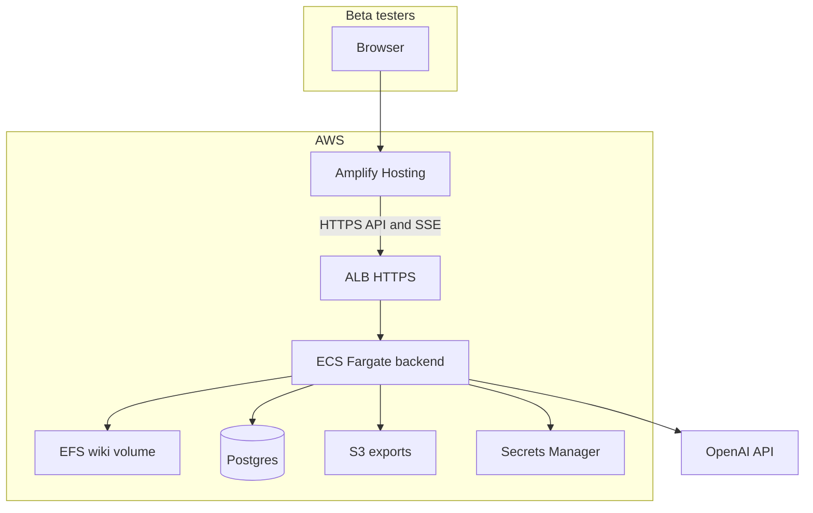
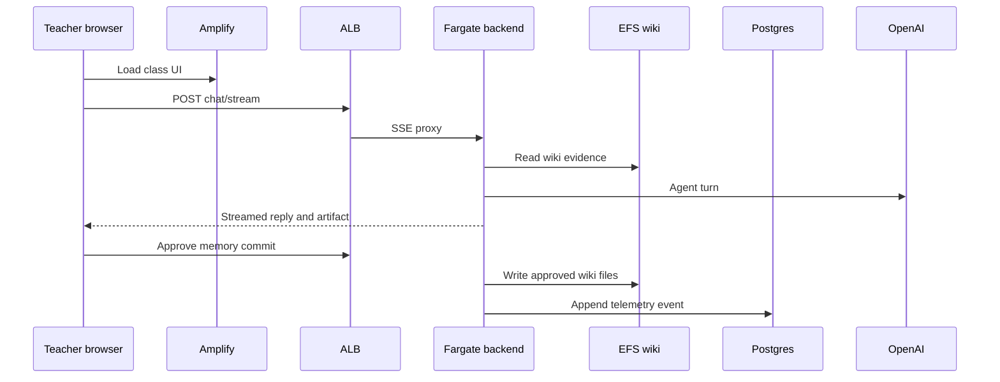

# Beta Push Plan

Goal: ship KlassenPilot to first beta testers in a way that preserves the core
memory loop, separates each tester's data, and gives the team enough telemetry
to see how memory evolves from real use.

This is not a production SaaS plan. It is a controlled research beta: 2-3
invited teachers, isolated copies of the mock Chemie 9b wiki, durable
operator-side event/session logs, and a cloud deployment that can be operated
without building a full account, billing, school-admin, or multi-tenant
platform.

## Beta Definition

The beta is good if it answers one sharp question:

> Can a teacher update class memory, trust what changed, and get a better next
> lesson plan because of it?

Primary beta signals:

- Memory updates completed per tester per week.
- Plans saved after memory updates.
- Teacher edits needed before saving diary or plan artifacts.
- Time from opening a class to a useful saved artifact.
- Trust breaks: wrong target, bad memory, missing evidence, confusing approval.
- Survey feedback on trust, usefulness, and whether the wiki feels like it is
  evolving in the right direction.
- Repeat use after the first session.

Non-goals for beta:

- School-wide accounts or roles.
- Production-grade session history UX.
- Voice, Telegram, broad open-web browsing, or assessment generation unless core
  loop testing is already healthy.
- Real student names or sensitive real student records.

## Fixed Beta Assumptions

- Testers: 2-3 beta testers.
- Class data: one mock class only, `chemie_9b_2026_27`.
- Persistence visible to testers: no polished saved chat-history product UX.
- Persistence for operator/research: transcripts, events, artifacts, memory
  states, wiki diffs, and errors are stored for analysis.
- Cloud: **AWS only** — frontend and backend in one account/region (default
  `eu-central-1` if testers are in Germany).
- Test duration: 2 weeks active testing.
- Retention: keep beta data for 2 additional weeks after testing, then export
  or delete according to the final research decision.

## Minimum Beta Scope

Local status as of the first tester-prep pass:

- **Shipped locally:** invite-code login, signed opaque HTTP-only session cookie,
  request identity resolution, per-workspace wiki copies, local SQLite beta
  telemetry, per-file wiki diffs for approved writes, Markdown beta report CLI,
  and Memory Sweep review UX for accumulated memory signals.
- **Still before external hosted beta:** move storage from local
  `beta_data/` to persistent AWS resources, configure HTTPS/CORS/secrets, run
  smoke tests after backend restarts, and document the operator beta routine.

Ship these before inviting external testers:

1. **Tester isolation**
   - Each tester gets a distinct `workspace_id` / `tester_id`.
   - Each tester gets their own wiki root cloned from the mock seed wiki or a
     manually prepared starter wiki.
   - No tester can read or write another tester's wiki.
   - Local implementation exists with `RequestIdentity`; hosted beta should keep
     this boundary and only change storage/deployment plumbing.

2. **Research persistence**
   - Persist chat messages, artifact drafts, final artifacts, memory runtime
     payloads, commit decisions, and errors for analysis.
   - Persist wiki before/after snapshots or diffs for every memory commit.
   - Keep app sessions in memory if needed, but do not lose research data when
     a chat turn or commit completes.
   - Local SQLite telemetry exists; AWS beta should promote metadata/events to
     Postgres/Aurora and keep operator exports in S3.

3. **Memory update trust**
   - Update Memory target/date/intent is visible.
   - Wiki file proposals are reviewed before commit.
   - Commit result shows what changed.
   - Add visible memory/profile suggestions after save if time allows; this is
     the most important Hermes-like product polish.

4. **Basic evidence visibility**
   - Surface compact source/evidence summaries from runtime state.
   - Start with class wiki sources and memory evidence briefs; no broad source
     explorer yet.

5. **Operator review**
   - A developer/admin can inspect per-tester sessions, event logs, final
     artifacts, and wiki diffs after each testing day.
   - Local Markdown report CLI exists; keep CLI-first until daily review proves
     a dashboard is needed.

6. **Small beta docs**
   - Tester-facing quickstart for the mock Chemie 9b beta.
   - Operator runbook for provisioning testers, reviewing telemetry, exporting
     data, and cleaning up after the retention window.

## Core Workflow-Enabling Features

The beta should enable the two current workflows, **Update Memory** and
**Create Lesson Plan**, without turning the product into a broad teaching
platform.

### 1. Trusted Online Search v0

Purpose: support lesson planning and context enrichment when class wiki memory
is not enough.

Scope:

- Read-only search/browse tool.
- Allowlisted or clearly trusted sources only.
- Start with Wikipedia, major reputable news outlets, official curriculum or
  public education sources, and narrow subject resources where useful.
- Source cards or inline source metadata must distinguish external sources from
  class memory.
- No automatic writes from web sources into the wiki.
- External facts can be used in a plan only when cited or source-labeled.

Beta acceptance:

- A tester can ask for a current/reputable example or background source and see
  which source was used.
- The agent does not blur "class memory says" with "external source says."

### 2. Better Initial Class Dashboard

Purpose: make the class home feel like the copilot already looked.

Scope:

- A compact class brief on entry:
  - last taught lesson
  - current unit / recent sequence
  - active open loops
  - top misconceptions
  - likely next move
  - sparse/missing memory warnings
- Keep it read-only for beta.
- No broad persistent suggested-task stack yet.

Beta acceptance:

- Tester can understand what is going on in Chemie 9b without opening raw wiki
  files.
- Tester can jump directly to Update Memory or Create Lesson Plan from the
  brief.

### 3. Update Memory From Class Date Entry

Purpose: reduce friction from the timeline/lesson detail view.

Scope:

- From a planned lesson date: start Update Memory with
  `update_missing_results`, known date, title, and saved plan loaded.
- From a taught lesson date: start Update Memory with
  `correct_existing_results` and existing results loaded.
- Unknown dates remain unconfirmed and require target confirmation.
- The target/date/intent status remains visible in the memory workspace.

Beta acceptance:

- Tester can click a timeline/date entry and immediately add or correct memory
  without re-explaining the target.
- Commit still goes through teacher-approved file proposals.

### 4. Survey And Wiki-Evolution Feedback

Purpose: measure whether the memory system is improving, not just whether the
UI works.

Scope:

- Short post-session or end-of-week survey.
- Ask about:
  - whether the wiki captured the right teaching facts
  - whether the next plan improved because of prior memory
  - what memory felt wrong, stale, or missing
  - how much editing was needed before saving
  - whether the approval flow felt trustworthy
- Link survey responses to `tester_id`, week, and optionally session ids.

Beta acceptance:

- Each tester gives at least one structured feedback response per week.
- Operator can compare survey comments with wiki diffs and session transcripts.

## Data Model

Keep this deliberately small. Prefer append-only research logs plus isolated
wiki roots.

Core identifiers:

- `tester_id`: invited beta tester.
- `workspace_id`: isolated workspace for a tester, usually one-to-one for beta.
- `class_id`: class inside that workspace.
- `session_id`: artifact chat session.
- `event_id`: append-only telemetry event id.

Suggested stored records:

- `tester`
  - `tester_id`
  - display label or alias
  - invite code hash
  - created/disabled timestamps

- `workspace`
  - `workspace_id`
  - `tester_id`
  - `wiki_root`
  - seed name/version
  - created timestamp

- `session`
  - `session_id`
  - `workspace_id`
  - `class_id`
  - mode: `ingest` or `plan`
  - started/last_active timestamps
  - status

- `event`
  - timestamp
  - `tester_id`, `workspace_id`, `class_id`, `session_id`
  - type
  - payload JSON

Minimum event types:

- `session_started`
- `chat_turn_started`
- `chat_turn_completed`
- `draft_updated`
- `proposal_generated`
- `proposal_item_approved`
- `proposal_item_rejected`
- `memory_committed`
- `plan_saved`
- `profile_suggestion_generated`
- `profile_suggestion_applied`
- `error`

For beta analysis, store sanitized payloads but keep enough detail to inspect
failures:

- teacher message text
- assistant reply
- final `diary_markdown` / `plan_markdown`
- `memory_state` / planning runtime payload
- proposal paths, approval flags, and changed content hashes
- applied wiki paths
- error code/message

## Storage Options

Recommended beta path: **file wiki + SQLite/Postgres metadata**.

### Option A - Local file roots plus SQLite

Best for a very small private beta on one VM/container host.

- Per-tester wiki roots live on a persistent mounted disk.
- SQLite stores testers, workspaces, sessions, and events.
- JSONL event export can mirror SQLite for easy offline analysis.

Pros:

- Few code changes.
- Easy to inspect and back up.
- Matches current markdown wiki architecture.

Risks:

- Not good for multiple backend replicas.
- Needs disciplined backups.
- Operationally fragile if hosted on ephemeral container storage.

### Option B - File wiki plus Postgres

Best AWS beta default.

- Per-tester wiki roots live on persistent shared storage.
- Postgres stores testers, sessions, and telemetry events.
- Optional object storage stores daily wiki snapshots and exported trace bundles.

Pros:

- Cleaner path to hosted beta.
- More robust telemetry queries.
- Backend can restart without losing research records.

Risks:

- Slightly more setup than SQLite.
- Still requires care around file wiki persistence.

### Option C - Object-store wiki

Defer unless file persistence becomes a blocker.

- Store every wiki file in S3 instead of local filesystem paths.
- Requires a storage facade refactor around `WikiStore`.

Pros:

- Cloud-native durability.
- Easier backups and per-workspace prefixes.

Risks:

- Bigger code change.
- Current code expects filesystem semantics.

Recommendation: use **Option B** if shipping to external testers in the cloud;
use **Option A** only for a tiny founder-led pilot.

## AWS Deployment

Ship frontend and backend on AWS. Use **dev-sized** resources (single-AZ,
minimal redundancy) unless the beta scope grows.

The current local beta architecture maps directly to AWS:

- `tester_id` and `workspace_id` remain the stable product identity shape.
- The identity resolver can stay invite-code based for beta.
- Workspace wiki roots move from `beta_data/workspaces/{workspace_id}` to EFS.
- Local `beta.sqlite3` metadata/telemetry moves to Postgres/Aurora.
- Report exports move to S3.
- The FastAPI app still receives a `RequestIdentity`; routes should not depend
  on Cognito/Auth.js/Clerk/Auth0-specific objects.

### Stack

| Layer | Service | Role |
|-------|---------|------|
| Frontend | **Amplify Hosting** | Next.js app, HTTPS, custom beta domain |
| API | **ECS Fargate + ALB** | FastAPI, SSE chat streams |
| Wiki | **EFS** | Per-workspace markdown wiki roots (filesystem semantics) |
| Telemetry | **RDS Postgres** or Aurora Serverless v2 | Testers, workspaces, sessions, events |
| Exports | **S3** | Wiki snapshots, trace bundles, operator exports |
| Secrets | **Secrets Manager** | `OPENAI_API_KEY`, DB URL, invite pepper |
| Logs | **CloudWatch** | Container and ALB access logs |

Why this stack:

- Fargate fits long-running FastAPI and agent turns up to ~4 minutes.
- EFS keeps the current `WikiStore` filesystem model with limited code change.
- Postgres holds beta telemetry without overloading the wiki.
- Amplify is the natural AWS home for the existing Next.js frontend.

### Architecture



### Request path



### Beta constraints

- **One Fargate task** for the first cut — avoids multi-writer EFS issues and
  keeps SSE session handling simple.
- **ALB idle timeout ≥ 300s** — agent turns can run up to 240s
  (`agent_timeout_seconds`).
- **`APP_ENV=production`** — enables stream/output safety guards in the backend.
- **`cors_origins`** — must include the Amplify beta domain only.
- **`NEXT_PUBLIC_API_BASE_URL`** — set at Amplify build time to the ALB HTTPS URL.
- **OpenAI key** — backend Secrets Manager only; never Amplify client env.
- **Region** — prefer `eu-central-1` for German testers; confirm OpenAI data
  handling separately.

### Infra deliverables (before invite)

- Production `backend/Dockerfile` (no `--reload`).
- CDK or CloudFormation stack: VPC, ALB, ECS, EFS, RDS, S3, secrets, IAM.
- Amplify app wired to the repo `frontend/` directory.
- Smoke test: class list, Update Memory SSE, commit, plan save, event export,
  backend restart with wiki and telemetry intact.

### Cost-conscious beta note

Fixed monthly drivers at dev scale: ALB (~$16–20), NAT Gateway (~$32 if tasks
use private subnets), Fargate 0.5 vCPU/1GB (~$15–25), RDS minimum tier
(~$15–50), EFS/S3/CloudWatch usually small at 2–3 testers. For a private mock-data
beta only, a public-subnet Fargate task avoids NAT cost at weaker network isolation.

## Backend Implementation Plan

### Phase 1 - Workspace identity

Add a minimal beta identity layer.

Likely touchpoints:

- `backend/app/api/routes.py`
- `backend/app/api/deps.py`
- `backend/app/config.py`
- `backend/app/teacher_agent/wiki/store.py` or `WikiStore` construction

Actions:

- Add `workspace_id` resolution from invite/session cookie or request header.
- Map `workspace_id` to a wiki root.
- Ensure every class API call uses the workspace-scoped wiki root.
- Add a protected beta invite/login route or very small access gate.

Acceptance:

- Tester A and Tester B can both use `chemie_9b_2026_27` without shared files.
- A request cannot access a workspace not tied to the current tester.

### Phase 2 - Workspace provisioning

Actions:

- Add a script/API to create a beta workspace from a seed wiki.
- Copy `backend/teacher_wiki` into a workspace-specific root.
- Record seed version and creation timestamp.

Suggested local layout:

```text
backend/beta_data/
  workspaces/
    {workspace_id}/teacher_wiki/
  exports/
    {workspace_id}/
```

Cloud layout with EFS:

```text
/data/klassenpilot/workspaces/{workspace_id}/teacher_wiki/
```

Acceptance:

- Creating a workspace produces a runnable isolated wiki.
- Class list, memory update, commit, and plan save all work inside that root.

### Phase 3 - Event/session logging

Add a small telemetry service with an append-only interface.

Likely touchpoints:

- `backend/app/services/artifact_session_service.py`
- `backend/app/services/ingest_service.py`
- `backend/app/services/plan_service.py`
- `backend/app/api/routes.py`
- new `backend/app/services/beta_telemetry.py`

Actions:

- Log lifecycle events for start, turn completion, draft patch, proposal,
  commit, plan save, and errors.
- Include `tester_id`, `workspace_id`, `class_id`, `session_id`, mode, and
  timestamps.
- Store payload JSON in Postgres or SQLite.
- Mirror to JSONL in development if useful.

Acceptance:

- A full Update Memory flow produces a readable event sequence.
- A full plan flow produces a readable event sequence.
- Errors are logged with enough context to reproduce.

### Phase 4 - Wiki snapshots and diffs

Actions:

- Before memory commit, snapshot affected wiki paths or whole workspace.
- After commit, store applied paths and before/after hashes.
- Export a compact review bundle per session.

Acceptance:

- For any `memory_committed` event, the operator can inspect what changed and
  why it was approved.

### Phase 5 - Operator export

Actions:

- Add a script to export tester data:
  - events JSONL
  - sessions JSON
  - final diary/plan artifacts
  - applied wiki files or diffs
  - errors
- Keep this CLI-only for beta unless a dashboard becomes necessary.

Acceptance:

- One command exports a tester's beta run for review.

### Phase 6 - Beta docs

Actions:

- Add a short tester quickstart:
  - what the mock class is
  - the two workflows to try
  - how to use the survey
  - what not to enter, especially real student names or sensitive data
- Add an operator runbook:
  - create tester workspace
  - verify deployment health
  - inspect event/session logs
  - export tester data
  - delete or archive data after the retention window

Acceptance:

- A tester can start without a live walkthrough.
- The operator can run the beta for 2 weeks and clean up data afterward.

## Frontend Implementation Plan

Actions:

- Add beta entry route for invite/workspace selection.
- Store auth/session token in cookie.
- Ensure API calls include credentials or workspace header as chosen.
- Add small tester-facing labels when using a seeded mock class.
- Keep teacher workflow UI mostly unchanged.
- Configure Amplify build: `NEXT_PUBLIC_API_BASE_URL` → ALB HTTPS URL; validate
  SSE chat end-to-end from the deployed domain.

Acceptance:

- Tester opens the Amplify beta URL, enters invite code, lands in their isolated
  class workspace, and can complete memory update and planning.

## Security And Privacy Boundary

For beta:

- Use mock or pseudonymized class data by default.
- If testers use real data, require explicit consent and prohibit real student
  names in broad memory.
- Do not expose trace endpoints publicly unless protected.
- Keep admin exports private.
- Log enough for product learning, not hidden reasoning traces or secrets.
- Store OpenAI keys only in backend Secrets Manager, never Amplify client env.

## Deployment Steps

AWS checklist:

1. Build backend production Docker image and push to ECR.
2. Provision EFS at `/data/klassenpilot` for per-workspace wiki roots.
3. Provision RDS Postgres (or Aurora Serverless v2) for beta telemetry.
4. Deploy ECS Fargate service with EFS mount, secrets, and `APP_ENV=production`.
5. Put the service behind an HTTPS ALB (idle timeout ≥ 300s).
6. Configure `cors_origins` for the Amplify beta domain.
7. Deploy `frontend/` to Amplify with `NEXT_PUBLIC_API_BASE_URL` → ALB URL.
8. Create one or two beta workspaces from the mock wiki.
9. Run smoke tests:
   - class list
   - Update Memory chat (SSE end-to-end)
   - proposal/commit
   - plan chat/save
   - event export
   - backend restart and wiki + telemetry still present

## Auth Evolution

Keep beta auth intentionally small until tester pull is proven.

Current beta:

- Invite code -> opaque HTTP-only cookie.
- Cookie resolves to `RequestIdentity(tester_id, workspace_id, role)`.
- APIs and wiki-store dependencies use `RequestIdentity` to choose the wiki root.

Production path:

1. Keep the `RequestIdentity` contract as the boundary.
2. Replace only the invite-code/session resolver with Cognito, Auth.js, Clerk,
   Auth0, or another OAuth/OIDC-backed provider.
3. Add durable user/account/workspace membership tables.
4. Continue mapping the provider subject to `{ tester_id/user_id,
   workspace_id, role }` before any route touches class data.
5. Add school/team roles only after there is clear need; do not add them for the
   first teacher beta.

This preserves the current isolation model while avoiding a premature SaaS
account system.

## Testing

Focused deterministic tests before beta deployment:

```powershell
cd backend
.\.venv\Scripts\python -m pytest tests\test_api_ingest.py tests\test_memory_update_state.py tests\test_wiki_context_packs.py tests\eval\test_memory_update_contract.py tests\test_api_plan.py tests\test_api_stream.py -q
```

Add new beta tests:

- workspace creation clones the seed wiki
- workspace-scoped APIs cannot cross-read another workspace
- telemetry records expected events
- memory commit records before/after changed paths
- export script includes sessions, events, artifacts, and wiki diffs
- docs links exist for tester quickstart and operator runbook

## Open Questions

Answered for first beta:

1. Use only the mock/seeded Chemie 9b wiki.
2. One class per tester is enough.
3. Persist transcripts operator-side only.
4. AWS for frontend and backend; default region `eu-central-1` unless constraints
   say otherwise.
5. Run testers for 2 weeks and retain data for 2 additional weeks.

Still open:

1. Exact survey questions and cadence.
2. Whether trusted online search v0 ships before the first tester or during the
   beta window.
3. Whether operator export is enough or a tiny admin review page is needed.
4. Final names/paths for the tester quickstart and operator runbook.

## Recommended First Cut

For the first beta push:

- **Amplify Hosting** for the Next.js frontend.
- **ECS Fargate + ALB** for the FastAPI backend.
- **EFS** for persistent per-workspace markdown wiki roots.
- **Postgres** for tester/session/event metadata.
- **S3** for export/backups.
- Simple invite-code access.
- CLI operator export instead of an admin dashboard.

This gives enough durability and observability to learn from testers without
turning the MVP into a full SaaS platform too early.
