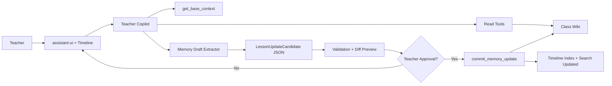
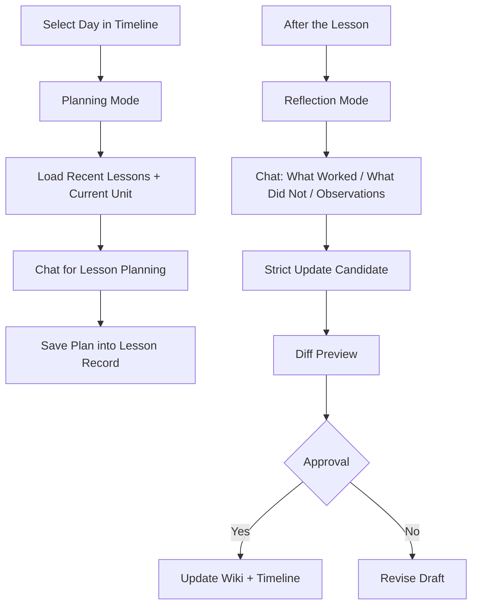
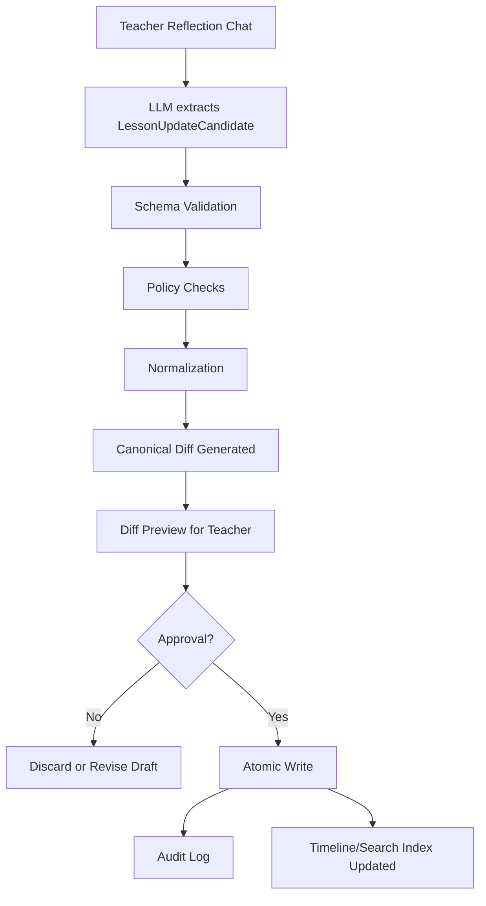

# Best Practices for a Teacher Copilot

## Executive Summary

For your MVP, the best operating model is **not a large multi-agent graph**, but **one visible Teacher Copilot with very clear workflow boundaries**: a **read-only planning mode** for lesson planning and a **separate write-capable update path** for memory updates that are persisted only after teacher approval.

This recommendation fits both the design principles of the OpenAI Agents SDK, which emphasizes a small number of clear primitives, and the transferable lessons from AutoSci, AutoScientists, and Hermes: durable, structured working memory is valuable, but complex multi-agent architectures mainly pay off for long-running, open-ended research tasks — not for a focused teacher copilot with two core workflows.

The strongest architecture for your use case is therefore:

- **Class-scoped wiki memory** as the canonical store.
- **A compact base context pack** loaded at the beginning of each planning session.
- **Targeted range/topic browsing** only when needed.
- **Deterministic writes** through strictly validated structures plus a diff preview.
- **Explicit teacher approval** before durable memory is changed.

This approach aligns well with the Hermes distinction between a “small curated memory” and on-demand session search, and with education-focused examples such as Shiksha Copilot, where teachers use AI-generated lesson planning but actively review, adapt, and translate outputs into local classroom practice.

For teacher trust, three things matter most:

1. **No silent writes.**
2. **Honest reporting of missing or sparse memory.**
3. **Visible, lightweight evidence anchors** in generated plans.

Research on teacher trust in generative AI emphasizes that adoption depends not only on technical quality, but also on leadership, policies, training, professional control, and socio-ethical safeguards. At the same time, work on citation-grounded generation shows that citations are useful but not automatically reliable; post-hoc verification can significantly improve quality.

Technically, your current stack is already close to a good target architecture:

- **assistant-ui** for the interaction layer and timeline-centered UX.
- **OpenAI Agents SDK** for tools, sessions, human-in-the-loop approval, guardrails, tracing, and structured outputs.
- **Markdown files with frontmatter** for durable wiki memory.
- **SQLite FTS5** and **ripgrep** for fast, cheap, file-based retrieval.

You should add a graph, vector store, or larger index redesign only once the retrieval or scaling limits of the file-based wiki are measurably reached.

Privacy and school context shift the priorities further toward:

- strict class isolation,
- data minimization,
- privacy by design,
- risk-appropriate security,
- no automated grading as a default behavior,
- no emotion recognition in educational contexts,
- and AI literacy measures for staff and users in the EU context.

For a Teacher Copilot, that means storing student observations only as granularly as needed for instructional continuity, preferably pseudonymized or aggregated; sensitive raw data should not become default memory.

---

## Recommended Operating Model

The best MVP orchestration is **one manager agent with class-scoped local context**, where almost everything happens through **small, clearly described function tools**.

The OpenAI Agents SDK encourages short, explicit tool descriptions, strict validation, and small composable tools. A key design detail is that **tool guardrails apply to function tools**, not necessarily to every kind of handoff or hosted tool. For safety-critical boundaries — especially writes — you should therefore concentrate mutation behind a single write gateway rather than spreading it across loose handoffs.

The SDK’s local run context is also not visible to the model. That is exactly where `teacher_id`, `class_id`, roles, approval rights, and tenant scope should live.

A robust split for your use case is:

| Component | Rights | Task | Recommended Tools |
|---|---|---|---|
| Teacher Copilot | read-only orchestration | Detects mode, loads base context, decides whether to browse or ask a question | `get_base_context`, `list_lessons`, `read_lesson`, `read_lesson_range`, `search_class_memory` |
| Browser | read-only | Retrieves only the evidence needed for the plan | same read tools, but with a stricter budget |
| Memory Draft Extractor | read-only | Produces a strictly typed `LessonUpdateCandidate` from reflection chat plus the existing lesson file | no writes; read tools only |
| Commit Gateway | write-capable, approval-gated | Validates, shows diff, writes atomically, reindexes | `commit_memory_update` with approval |

If you use subagents, use them only for **specialization**, not for spreading state. OpenAI describes handoffs as useful when agents truly have different specializations, while manager patterns give you one central place for guardrails and limits.

For your MVP, **manager + tools** is usually better than a free handoff network. If you do use handoffs, use a clear handoff prompt preamble and filter tool noise out of the transferred context.

The most important memory rule is:

> Small base memory always; long-tail memory only on demand.

Hermes follows this pattern by separating a small prompt-injected memory from separately searchable conversation history. For your product, this means: at the beginning of a planning run, automatically load recent lessons, the current unit, open follow-ups, and stable class notes. Only if that is insufficient should the agent browse by date, topic, or range.

The target product flow is:



For the product UX, the **timeline click** should not only open a detail view. It should also set a structured `runConfig`:

```json
{
  "class_id": "chemistry_9b",
  "lesson_id": "2026-09-16_chemistry_9b",
  "date": "2026-09-16",
  "mode": "planning"
}
```

This makes the timeline not just UI, but the primary scope setter for clean agent runs.

A second useful flow diagram:



---

## Prompt Patterns and Contracts

Good system prompts for your case should be **contractual**, not overly creative. They should define:

- role,
- allowed tools,
- forbidden actions,
- evidence requirements,
- sparse-memory behavior,
- output format.

This is consistent with OpenAI recommendations to set instructions explicitly, use structured outputs, and make handoff behavior explicit when multi-agent workflows are involved.

### Planning Agent

This template is intended for your read-only lesson-planning workflow. It is intentionally narrow so that a fast model running at low reasoning effort can still behave reliably.

```text
# Role
You are Teacher Copilot for exactly one teacher and one class.

# Workflow Contract
Your current mode is: LESSON_PLANNING_READ_ONLY.
You must NEVER write, modify, confirm, or simulate saving wiki content.
You may only read, plan, summarize, and ask questions.

# Scope
Work only within class_id={{class_id}}.
If information from another class might appear relevant, ignore it.

# Default Behavior
1. Always start from the provided base context pack.
2. Use browsing tools only when the teacher's request exceeds that context.
3. Use as few tool calls as possible.
4. If stored memory is thin or unclear, ask exactly ONE targeted clarifying question.
5. If gaps remain after browsing, state them honestly and plan conservatively.

# Evidence Rules
- Every non-trivial claim about prior knowledge, open difficulties, coverage, or next steps must be grounded in stored evidence.
- Use lightweight inline citations such as [L-2026-05-19], [R-2026-05-12..2026-05-19], [M-group-work], [GAP].
- Mark conclusions drawn from multiple sources as "Inference" in the evidence block.

# Output Format
Respond in this order:
1. Short takeaway
2. Lesson plan
3. Required materials
4. Differentiation / risk points
5. Evidence block
6. Open gap or targeted clarifying question, if needed

# Style
Practical, teacher-facing, concise.
Do not expose internal agent reasoning or tool logs.
```

### Browse Subagent

The browse subagent should not write polished answers. It should produce **compact evidence packets**. This keeps the main agent focused, makes citations more reliable, and helps enforce tool budgets.

```text
# Role
You are a read-only evidence browser for class memory.

# Goal
Return only the minimum evidence needed for the parent agent's request.

# Allowed Actions
- list lessons by date or topic
- read individual lesson records
- read compact date ranges
- search class memory

# Forbidden
- no lesson plans
- no mutations
- no speculation
- no invented sources

# Return Format
Return a JSON object:
{
  "sources": [
    {
      "source_id": "...",
      "source_type": "lesson|range|memory",
      "date_or_range": "...",
      "support": "direct|summary|inference",
      "facts": ["...", "..."]
    }
  ],
  "coverage": "sufficient|partial|thin",
  "missing": ["...", "..."]
}

# Budget
Maximum:
- 1 list call
- 1 range read
- 2 individual lesson reads
- 1 search

Stop earlier if coverage is sufficient.
```

### Memory Draft Extractor

For the memory-update workflow, the LLM should **not write directly**. It should produce a structured candidate. Persistence is handled by deterministic code with schema checks, policy filters, and approval.

```text
# Role
You are a Memory Draft Extractor for teacher reflections after a lesson.

# Workflow Contract
Your mode is: MEMORY_UPDATE_DRAFT_ONLY.
You must NEVER write or simulate a commit.
You only produce a structured candidate for a later approved write.

# Inputs
- Teacher reflection chat
- Current lesson record
- Neighboring lesson records if provided
- Class policies

# Extraction Rules
- Extract only points clearly supported by the teacher's reflection.
- Condense free-form conversation into compact, reusable entries.
- Do not store raw dialogue.
- Do not store sensitive personal data by default.
- Use student observations only in aggregated or pseudonymized form where possible.
- Separate observation, interpretation, and next action.

# Output
Return strictly the LessonUpdateCandidate schema.
If information is unclear, use null or "unknown" instead of guessing.
```

### Sparse-Memory Question Generator

A good sparse-memory question should be narrow, contextualized, and easy to answer.

```text
Generate exactly ONE targeted clarifying question.

Rules:
- Ask only if the gap is relevant to planning.
- Do not ask broad meta-questions.
- State what was already found.
- Ask only for the smallest missing piece of information.
- Maximum 35 words.

Template:
"I found {{found_scope}}, but not {{missing_item}}.
Should I plan based on {{safe_default}}, or was there an undocumented lesson about this?"
```

### Example `agent_contracts.md`

The contracts should live in the repo and be updated before or alongside code changes.

```md
# Agent Contracts

## Teacher Copilot
- Purpose: teacher-facing orchestration for one class at a time
- Scope: exactly one class_id per run
- Allowed tools:
  - get_base_context
  - list_lessons
  - read_lesson
  - read_lesson_range
  - search_class_memory
  - create_memory_update_draft
  - commit_memory_update (approval required)
- Forbidden:
  - any silent mutation
  - any cross-class retrieval
  - any fabricated citation
- Required behavior:
  - use base context first
  - browse only when needed
  - cite every non-trivial memory-grounded claim
  - ask one targeted question when memory is sparse
  - admit gaps explicitly

## Lesson Planning
- Mode: read-only
- Input: teacher request + base context
- Output: practical lesson plan + lightweight citations
- Write policy: none
- Failure mode: return conservative draft with [GAP] and one targeted question if necessary

## Memory Draft
- Mode: read-only draft generation
- Input: teacher reflection chat + current lesson record
- Output: LessonUpdateCandidate (strict schema)
- Write policy: none
- Failure mode: null for uncertain fields; never guess

## Commit Memory Update
- Mode: write-capable, approval gated
- Input: LessonUpdateCandidate
- Preconditions:
  - schema valid
  - class_id matches current run context
  - forbidden-content checks passed
  - teacher approval recorded
- Side effects:
  - atomic file write
  - audit log append
  - search/timeline reindex
- Failure mode:
  - reject with human-readable diff/policy error
```

---

## Data Model and Write Pipeline

For your MVP, the best choice is a **Markdown wiki per class with frontmatter per lesson**.

This is close to AutoSci’s wiki-centered persistent-memory idea and Hermes’ file-based, compact curated memory pattern. The advantage is not just simplicity. It is also product fit: the file is simultaneously a data object for the agent, raw material for the timeline, and long-term teacher-readable documentation.

| Alternative | Strengths | Weaknesses | Fit for Your MVP |
|---|---|---|---|
| **Markdown + YAML frontmatter per lesson** | fast to implement, git-friendly, human-readable, easy to diff | requires schema discipline | **Best choice now** |
| JSON record per lesson + rendered Markdown view | deterministic, API-friendly | less readable, less teacher-friendly | good but unnecessarily heavy |
| Database-first with generated views | strong queries and joins | higher initial complexity and more operations burden | later, once scaling demands it |

Recommended folder structure:

```text
wiki/
  classes/<class_slug>/
    overview.md
    units/
      <unit_slug>.md
    lessons/
      2026-09-14_fractions_intro.md
      2026-09-16_fractions_practice.md
    memory/
      patterns.md
      students_aggregated.md
      constraints.md
    indexes/
      timeline.json
      search.sqlite
    audits/
      2026-09-16T18-20-45Z_commit.json
```

Recommended lesson-record schema:

```yaml
---
lesson_id: "8b_math_2026-09-16"
class_id: "8b_math"
date: "2026-09-16"
subject: "Mathematics"
topic: "Comparing fractions"
unit_id: "fractions_1"
status: "taught"
learning_objectives:
  - "Compare fractions with the same denominator"
  - "Justify fraction comparisons using visual models"
materials:
  - "Worksheet A"
  - "Board diagrams"
coverage_pct: 0.75
what_worked:
  - "Visualization with strip models"
what_did_not_work:
  - "Partner phase was too open-ended"
student_observation_tags:
  - "many_confused_with_numerator_vs_denominator"
  - "strong_response_to_visual_examples"
next_lesson_hooks:
  - "start slowly with comparing fractions with different denominators"
citations:
  - "L-2026-09-12"
  - "M-fractions-misconceptions"
teacher_approved_at: "2026-09-16T18:20:45Z"
---
## Plan
...

## Reality
...

## Reflection
...

## Evidence
...

## Next Lesson
...
```

The content should be **compact, information-dense, and reusable**. Hermes explicitly documents that memory entries should be small, actionable, and not just raw data or vague generalities. That is exactly right for teacher memory.

Instead of storing conversation transcripts, store stable fields such as:

- `student_observation_tags`,
- `coverage_pct`,
- `next_lesson_hooks`,
- short teacher-facing reflection blocks,
- open loops,
- misconceptions,
- lesson implications.

This improves prompt stability and limits both privacy and token risks.

For personal data, the default should be strict:

- no full student names,
- no special categories of personal data,
- no medical details,
- no free-floating behavioral profiles,
- no emotion recognition,
- no automated performance evaluation as default memory.

Practically, store only what is needed for the next lesson or unit-level instructional continuity.

The safe write pipeline should combine strict structure, deterministic policy checks, and real teacher approval:



Recommended deterministic checks before commit:

- schema is valid,
- `class_id` matches the current run context,
- `lesson_id` exists or is correctly created,
- field lengths and enum values are valid,
- forbidden fields are absent,
- citations refer to real lesson or memory IDs,
- diff is small enough for teacher review,
- approval state is positive.

---

## Evidence, Browsing, and UX

You need **lightweight citations** in the MVP, but with **precise semantics**.

The research since 2023 is clear: citations improve verifiability, but citation quality remains its own problem. Benchmarks such as ALCE show gaps, and work such as VeriCite and PaperTrail argues for evidence selection, verification, and claim-level provenance.

For your product, this means:

- simple visible citations for teachers,
- richer evidence objects in the backend.

Recommended visible citation format:

| Abbreviation | Meaning | Example |
|---|---|---|
| `L-<date>` | exact lesson | `L-2026-09-16` |
| `R-<start>..<end>` | condensed lesson range | `R-2026-09-01..2026-09-16` |
| `M-<slug>` | curated class memory | `M-fractions-misconceptions` |
| `GAP` | relevant missing information | `GAP-no_post_holiday_record` |

Recommended internal evidence object:

```json
{
  "claim_id": "differentiation_2",
  "source_id": "L-2026-09-16",
  "source_type": "lesson",
  "support": "direct",
  "span": ["what_did_not_work", 0],
  "note": "Partner phase was too open-ended"
}
```

The important distinction is between:

- **direct support**,
- **summary support**,
- **inference**.

For example:

- “Many students confused numerator and denominator” might be directly supported.
- “Therefore, the next lesson should start with visual models” is often an inference from multiple sources.

That distinction increases trust without overloading the UI.

### Browsing Budget

For browsing, use a **per-turn budget model**. This follows both SDK best practices for small, clearly described tools and the broader pattern of agentic retrieval: adaptive, not exhaustive.

| Situation | Default Budget | Goal |
|---|---|---|
| “Plan the next lesson” within the same unit | base context + max 1 range read | stay fast |
| explicit reference to older date/unit | 1 list + 1 range + max 2 lesson reads | targeted recall |
| derive assessment or worksheet | base context + last relevant lesson + 1 older comparison lesson | evidence for format/difficulty |
| after 3–4 reads memory is still thin | **stop and ask one question** | avoid blind search |
| very broad request | first narrow the scope | avoid tool sprawl |

Good sparse-memory UX is not:

> “I don’t know enough.”

It is:

> “I found X, but Y is missing; I can plan conservatively based on Z.”

Useful question templates:

| Situation | Template |
|---|---|
| missing last lesson | “I found lessons up to **{{date}}**, but no record for the most recent lesson. Should I plan from the last saved lesson, or was there an undocumented lesson in between?” |
| unclear coverage | “I see the unit and goal, but not how far the class actually got. Has **{{topic}}** already been introduced, or only previewed?” |
| unclear student difficulty | “The notes mention **{{pattern}}**, but not whether it was a minor or major difficulty. Should I build in a broad safety review or only a short recap?” |

The product rule should be:

> Ask at most one targeted clarifying question, then produce a conservative draft.

Too many questions reduce flow and perceived competence. No questions reduce trust in the pedagogical quality.

---

## MVP Tool Stack

Your current stack is directionally right. The OpenAI Agents SDK is strong enough for your two workflows — read-only planning and approval-gated writes — without requiring heavy custom orchestration. assistant-ui is a good frontend fit for threads, composer state, tool display, and a timeline-centered copilot UI.

| Priority | Tool / Library | Why Now | Main Downside |
|---|---|---|---|
| very high | **OpenAI Agents SDK** | Tools, human-in-the-loop, sessions, guardrails, tracing, structured outputs in one package | contracts must be modeled carefully |
| very high | **assistant-ui** | fast, production-like chat/copilot frontend with runtime state | requires clear backend events |
| very high | **Zod or Pydantic + JSON Schema** | strict inputs/outputs for drafts and writes | schema discipline costs time upfront |
| high | **Markdown + frontmatter** | readable, versionable wiki files | less powerful than database queries |
| high | **SQLite FTS5** | cheap, local full-text search and indexing | lexical, not semantic |
| high | **ripgrep** | exact, line-level search and debugging | no rich ranking |
| medium | **python-frontmatter / markdown-it-py** | robust frontmatter and Markdown parsing | adds a small parsing layer |
| later | **MCP** | standard external school/LMS/calendar integration | security and approval complexity increases |
| later | **DuckDB / Tantivy / Vector layer** | useful with real scale or hybrid search needs | more operational and data-model complexity |

Why this order makes sense:

- The Agents SDK already provides the primitives you need: tools with JSON schemas, approval flows, sessions, tracing, and usage tracking.
- assistant-ui provides the interaction layer, including runtime state, threads, composers, and tool rendering.
- SQLite FTS5 and ripgrep are often enough for a file-based wiki and are much faster to implement than an early vector or graph stack.
- `python-frontmatter` and `markdown-it-py` make file parsing stable without overcomplicating your data model.
- MCP should come later, once you really need external system integrations.

For your timeline UI, I would prioritize three integration steps:

1. **Timeline click sets `runConfig`** with `class_id`, `lesson_id`, and `mode`.
2. **Backend streams events**, not just text: reading, planning, approval requested, write completed.
3. **Every lesson detail view has a small machine-readable evidence block**, even if the MVP UI only shows a reduced version.

This prepares a later source panel without requiring you to build it now.

---

## Safety, Validation, and Scaling

For a Teacher Copilot in an EU or school context, the most important principle is:

> Teacher-centered, data-minimizing, class-isolated, approval-gated on writes.

UNESCO and recent teacher-agency discussions emphasize that AI should strengthen, not replace, teacher agency. KMK, the EU AI Act, and data-protection authorities add legal and organizational constraints for school contexts.

Recommended checklist:

| Control | Concrete Implementation |
|---|---|
| class isolation | `class_id` required in local run context; separate storage paths and search indexes per class |
| least data | no raw transcripts, no full student names by default, only purpose-bound observations |
| privacy by design | keep default fields small; sensitive fields only with explicit reason |
| security | encryption, access control, audit logs, regular checks |
| write governance | every write approval-gated, with diff, audit, and traceability |
| no automated grading | no automatic performance judgment as a default behavior |
| no emotion inference | no emotion recognition or biometric inference in the education context |
| AI literacy | internal training, short user guide, documented AI use practice |

The legal basis for this design direction is strong: GDPR requires lawfulness, transparency, purpose limitation, data minimization, storage limitation, integrity/confidentiality, privacy by design, and risk-appropriate security. The EU AI Act also places importance on AI literacy measures. Some German state-level school guidance is especially strict about emotion recognition and AI-supported performance assessment.

Your test and validation plan should combine three layers:

1. **Grounding**
2. **Write safety**
3. **Teacher trust**

The Agents SDK’s tracing and usage tracking can turn real production runs into evaluation data.

For grounding, create a golden set of anonymized teacher scenarios and measure how many plan-relevant claims are correctly supported.

For writes, measure:

- schema validity,
- policy rejection reasons,
- unwanted mutations,
- approval conflicts.

For teacher trust, measure not only satisfaction, but also:

- edit distance,
- acceptance rate,
- time saved,
- number of unresolved gaps,
- perceived control.

A pragmatic metric set for the first six weeks:

| Area | Core Metrics |
|---|---|
| Grounding | Valid-Citation Rate, Claim-with-Evidence Rate, Hallucination Rate |
| Retrieval | p50/p95 tool calls per plan, browse-stop rate after evidence saturation |
| Memory Update | Schema Pass Rate, Approval Rate, Reject-Reason Distribution |
| Privacy/Safety | Cross-Class Leakage Rate, forbidden-field hits, manual incidents |
| Teacher Trust | acceptance rate, mean editing time, trust/control mini-survey |
| Operations | p95 latency, cost per workflow, abandonment rate |

An LLM-as-judge layer can help with internal screening, but should not be the only quality authority. For your setting, at least part of the golden set should be manually evaluated by teachers or subject-didactics experts.

### Scaling Guidance

Scale late.

As long as the wiki is manageable and date/topic retrieval works reliably, stay with:

```text
Markdown + frontmatter + SQLite FTS5 + ripgrep
```

Add more infrastructure only when you observe specific failures:

| Add Later | Trigger |
|---|---|
| structured secondary index / DuckDB | date-range and aggregation queries become common |
| vector layer | semantic paraphrases regularly fail with FTS5 |
| graph browsing | teachers frequently ask about concept dependencies, long-term patterns across units, or network-like relationships |
| full source panel | teachers need auditability beyond lightweight citations |
| multi-agent review | lesson-plan quality plateaus and you can prove a review pass improves it |

The central lesson from AutoSci is not “build a graph immediately.” It is:

> Use durable memory, disciplined contracts, evidence-grounded synthesis, and reviewable writes.

---

## Open Questions and Limits

Direct empirical evidence for **K-12 teacher copilots with exactly your two workflows** is still limited in 2025–2026.

The closest product evidence comes from lesson-planning copilots such as Shiksha Copilot in real schools. AutoSci, AutoScientists, and Hermes mainly provide **transferable agent and memory design patterns**, not school-specific reference architectures.

Therefore, some thresholds in this report — for example tool-call budgets, scaling triggers, and file-size limits — should be treated as **engineering heuristics**. They should be recalibrated quickly using traces, evals, and teacher feedback.

---

## Practical Recommendation for Your MVP

For the next implementation phase, focus on these concrete moves:

1. **Lock the two workflow contracts**
   - Lesson planning is read-only.
   - Memory update is approval-gated and deterministic.

2. **Implement the base context pack**
   - current unit,
   - recent lessons,
   - open loops,
   - misconceptions,
   - stable class constraints.

3. **Add range-aware browsing tools**
   - list lessons,
   - read one lesson,
   - read compact lesson range,
   - search class memory.

4. **Add lightweight citations**
   - `L-YYYY-MM-DD`,
   - `R-start..end`,
   - `M-slug`,
   - `GAP`.

5. **Create the `LessonUpdateCandidate` schema**
   - strict JSON,
   - no guessing,
   - no raw transcripts,
   - separate observation / interpretation / next action.

6. **Build the commit gateway**
   - validate,
   - generate diff,
   - require approval,
   - atomic write,
   - audit log,
   - reindex.

7. **Instrument everything**
   - trace tool calls,
   - count citations,
   - record approval/rejection reasons,
   - measure teacher edits.

The best product summary remains:

> **A timeline-centered teacher copilot that plans from memory, captures classroom reality, updates memory deterministically after teacher approval, and uses that durable memory to improve the next lesson.**
